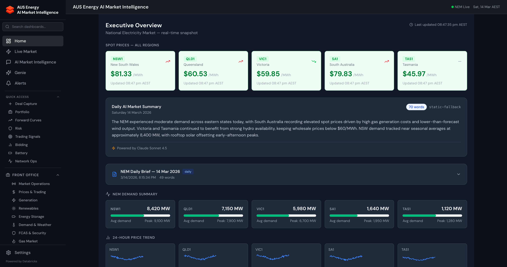
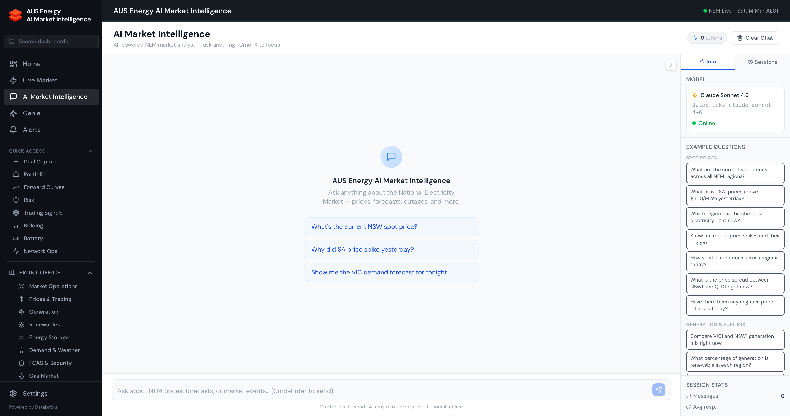
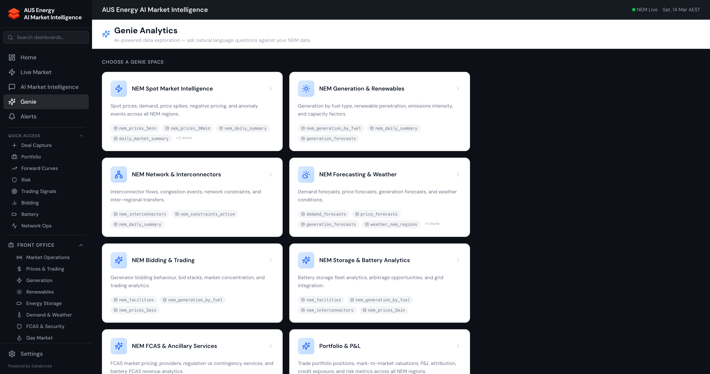
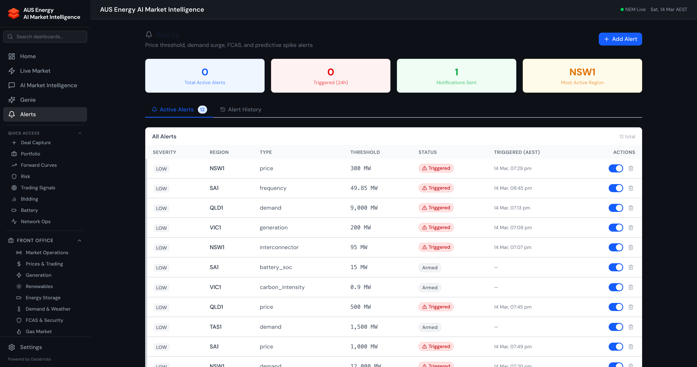

# AUS Energy AI Market Intelligence — User Guide

A comprehensive guide to the Energy Copilot application for Australian National Electricity Market (NEM) professionals.

## Table of Contents

- [Overview](#overview)
- [Getting Started](#getting-started)
- [Navigation](#navigation)
- [Core Features](#core-features)
  - [Home Dashboard](#home-dashboard)
  - [Live Market](#live-market)
  - [AI Market Intelligence](#ai-market-intelligence)
  - [Genie AI/BI](#genie-aibi)
  - [Alerts](#alerts)
- [Front Office](./guide-front-office.md)
  - Market Operations, Prices & Trading, Generation, Renewables, Energy Storage, Demand & Weather, FCAS & Security, Gas Market
- [Middle Office](./guide-middle-office.md)
  - Deal Capture, Portfolio, Forward Curves, Risk, Trading Signals, Bidding, Battery Optimisation
- [Back Office](./guide-back-office.md)
  - Settlement Back Office, Compliance, Environmentals, Reports, Network Operations
- [DNSP Intelligence](#dnsp-intelligence)
  - AER Regulatory, STPIS, Asset Intelligence, RAB Roll-Forward, Vegetation Risk, Workforce, AIO Submission, AI/ML Capabilities

---

## Overview

Energy Copilot is a full-stack Databricks App providing AI-powered market intelligence for the Australian National Electricity Market (NEM). It combines real-time market data, ML-driven forecasting, natural language analytics, settlement-grade back office workflows, and DNSP regulatory intelligence in a single platform.

### Key Capabilities

| Capability | Description |
|-----------|-------------|
| **564 analytics pages** | Dashboards spanning spot prices, generation, renewables, storage, FCAS, gas, WEM, DNSP, and more |
| **51 AI tools** | Claude Sonnet 4.5 agent with context-stuffed market data and 51 callable tools |
| **12 Genie spaces** | Natural language SQL against 108+ gold Delta tables (incl. DNSP Enterprise Intelligence) |
| **Real-time data** | NEMWEB 5-min dispatch (Pipeline 13, every 5 min), weather, solar, forecasts — ingested continuously |
| **5 AI/ML capabilities** | XGBoost asset failure prediction (92.3% acc), Claude FMAPI AIO drafts, XGBoost vegetation risk (88.7%), Prophet workforce forecasting (MAE 124h), Isolation Forest STPIS anomaly detection (93.4%) |
| **Settlement workflows** | AEMO settlement ingestion, true-up analysis, dispute management, GL journals |
| **Risk management** | VaR, MtM, credit checks, PPA valuation (Monte Carlo) |
| **DNSP Intelligence** | AER regulatory compliance, bushfire mitigation, RAB roll-forward, STPIS calculator, AIO submission pack |

### Architecture

The application is built on:

- **Frontend**: React 18 + TypeScript + Vite + Tailwind CSS + Recharts
- **Backend**: FastAPI with 64 routers serving 636+ REST endpoints
- **Data**: 108+ Delta gold tables, 30 scheduled pipeline jobs, Lakebase PostgreSQL serving layer (10-38ms reads)
- **AI**: Claude Sonnet 4.5 via Databricks Foundation Model API (FMAPI)
- **ML**: LightGBM models registered in MLflow, inference every 5 minutes
- **Pipelines**: 13 scheduled Databricks jobs (NEMWEB, weather, solar, forecasts, snapshots)

---

## Getting Started

### Accessing the Application

The app is available at: `https://energy-copilot-7474645691011751.aws.databricksapps.com`

Authentication is handled via Databricks SSO. Log in with your Databricks workspace credentials.

### First Steps

1. **Home Dashboard** — Start here for a high-level NEM overview with regional prices, generation mix, and demand
2. **Live Market** — Real-time 5-minute dispatch data across all NEM regions
3. **AI Market Intelligence** — Ask natural language questions about the market
4. **Genie** — Query structured data with natural language SQL

---

## Navigation

The sidebar organises the application into logical groups:

### Top-Level Navigation

| Item | Path | Description |
|------|------|-------------|
| Home | `/` | NEM market overview dashboard |
| Live Market | `/live-market` | Real-time dispatch data |
| AI Market Intelligence | `/ai-market-intelligence` | AI-powered chat with 50 tools |
| Genie | `/genie` | Natural language SQL (11 spaces) |
| Alerts | `/alerts` | Price spike, demand surge, data quality alerts |

### Quick Access

Eight frequently-used dashboards pinned for one-click access: Deal Capture, Portfolio, Forward Curves, Risk, Trading Signals, Bidding, Battery, Network Ops.

### Office Groups

The sidebar organises 497 pages into three office groups, each expandable with category sub-menus:

- **Front Office** — Market Operations, Prices & Trading, Generation, Renewables, Energy Storage, Demand & Weather, FCAS & Security, Gas Market
- **Middle Office** — Deal management, portfolio analytics, risk, trading signals
- **Back Office** — Settlement, compliance, environmental, reporting, network operations

---

## Core Features

### Home Dashboard

The home page provides a real-time NEM overview:

- **Regional spot prices** across all 5 NEM regions (NSW1, VIC1, QLD1, SA1, TAS1)
- **Generation mix** — fuel type breakdown (black coal, gas, hydro, wind, solar, battery)
- **Demand vs supply** — current demand with forecast overlay
- **Interconnector flows** — cross-regional power transfers
- **Recent anomaly events** — ML-detected price spikes and demand surges

### Live Market

Real-time 5-minute dispatch interval data sourced from NEMWEB:

- **Price heatmap** — colour-coded regional prices (green < $100, amber $100-$300, red > $300)
- **Generation by fuel** — stacked area chart showing fuel mix evolution
- **Interconnector utilisation** — flow direction and capacity usage
- **Price history** — intraday price chart with forecast overlay
- **Regional demand** — current vs forecast demand per region

Data refreshes every 5 minutes via the NEMWEB ingest pipeline.

### AI Market Intelligence

A conversational AI assistant powered by Claude Sonnet 4.6 with access to 50 specialised tools:

**How to use:**
1. Type a natural language question in the chat box
2. The AI analyses your question and calls relevant tools (visible as tool cards)
3. Responses include charts, tables, and narrative analysis
4. Multi-turn conversations maintain context

**Example questions:**
- "What's driving the high prices in SA right now?"
- "Compare wind generation across regions this week"
- "Value a 100MW solar PPA in QLD at $55/MWh for 10 years"
- "Show me recent settlement runs and their variance"
- "What are the active network constraints?"

**Tool categories (50 total):**

| Category | Tools | Examples |
|----------|-------|---------|
| Market Data | 8 | Prices, generation, interconnectors, FCAS, constraints |
| Forecasting | 5 | Price, demand, wind, solar forecasts |
| Analysis | 4 | Price event explanation, region comparison, market summary |
| Trading | 6 | Bid stack, trading signals, forward curves |
| Risk | 5 | VaR, MtM, credit check, PPA valuation, Greeks |
| Portfolio | 3 | P&L, portfolio summary, deal lookup |
| Settlement | 3 | Settlement runs, true-up analysis, finance summary |
| Network | 5 | Constraints, outages, DER fleet, network assets |
| Other | 11 | Weather, gas prices, emissions, compliance, alerts |

### Genie AI/BI

11 specialised Genie Spaces for natural language SQL queries against gold Delta tables:

| Space | Tables | Example Questions |
|-------|--------|-------------------|
| Spot Market | Prices, demand, region summary | "What was the average price in NSW last week?" |
| Generation | Generation by fuel, facilities | "Top 10 generators by output today" |
| Network | Interconnectors, constraints | "Which interconnectors are congested?" |
| Forecasting | Price & demand forecasts | "Show demand forecast accuracy for VIC" |
| Bidding & Trading | Bid stack, bid statistics | "What's the rebid rate for gas generators?" |
| Storage & Battery | Battery dispatch, arbitrage | "Battery revenue by region this month" |
| FCAS & Ancillary | FCAS prices, enablement | "FCAS costs by service type and region" |
| Portfolio & P&L | Deals, positions, MtM | "Total portfolio exposure by counterparty" |
| Bidding & Revenue Optimisation | Bid optimisation | "Optimal bid strategy for peaking gas plant" |
| Gas Market Analytics | Gas hub prices, pipelines | "East coast gas spot prices trend" |
| WEM Market Analytics | WA market data | "WEM balancing prices vs NEM comparison" |

**How to use:**
1. Select a Genie Space from the dropdown
2. Type your question or click a suggested question
3. Genie translates to SQL and returns results with charts

### Alerts

Configurable alert rules for market events:

- **Price spike alerts** — Moderate ($300+), High ($1,000+), Critical ($5,000+)
- **Sustained high price** — 30+ consecutive minutes above threshold
- **Demand surge** — Above 95th percentile
- **Data staleness** — No new data for 10+ minutes
- **ML model drift** — MAE or MAPE exceeding thresholds
- **Predictive spike** — ML spike probability >= 70%
- **Interconnector congestion** — Utilisation > 95%

---

## Detailed Guides

For detailed walkthroughs of each office area, see:

- **[Front Office Guide](./guide-front-office.md)** — Market analytics, generation, renewables, storage, FCAS, gas
- **[Middle Office Guide](./guide-middle-office.md)** — Deal capture, portfolio, curves, risk, trading signals, bidding, battery
- **[Back Office Guide](./guide-back-office.md)** — Settlement, compliance, environmentals, network operations, reporting
