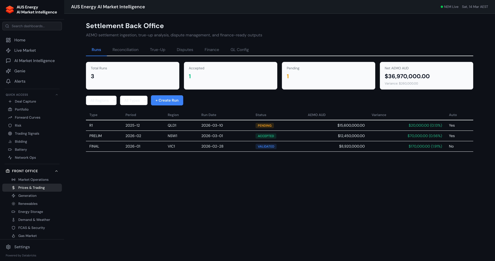
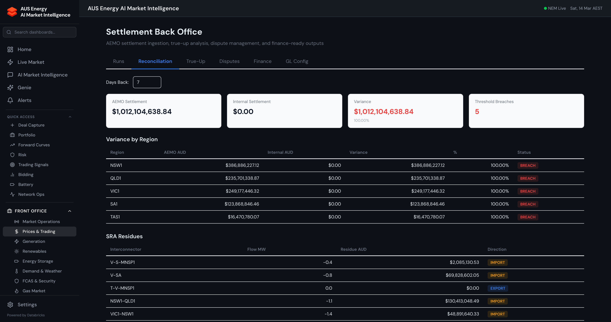
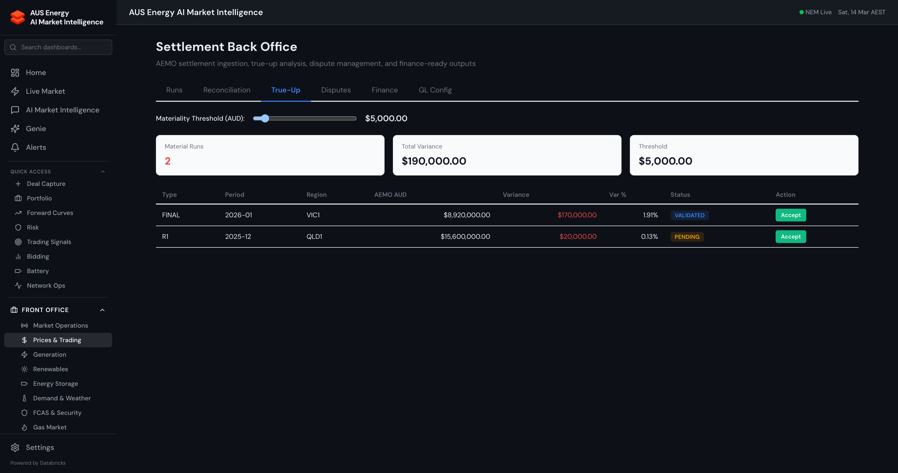
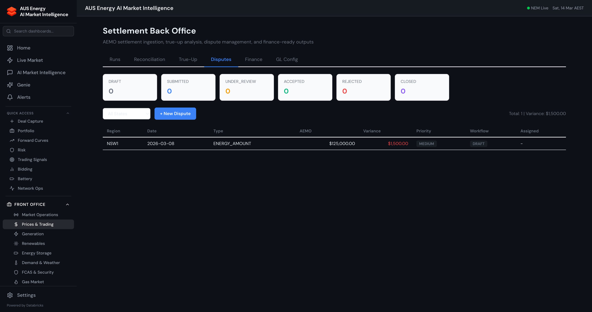
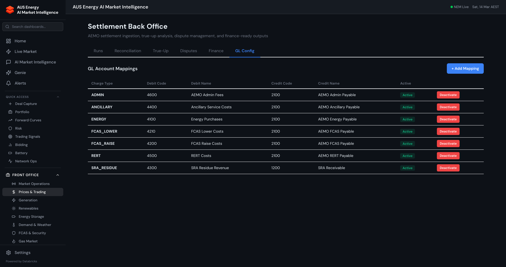
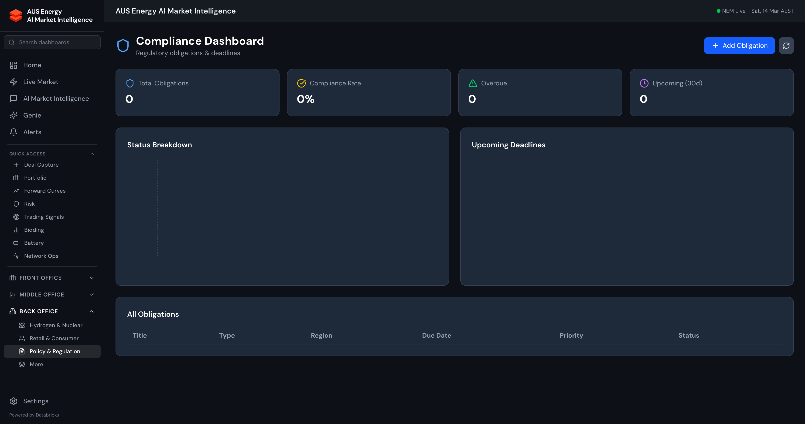
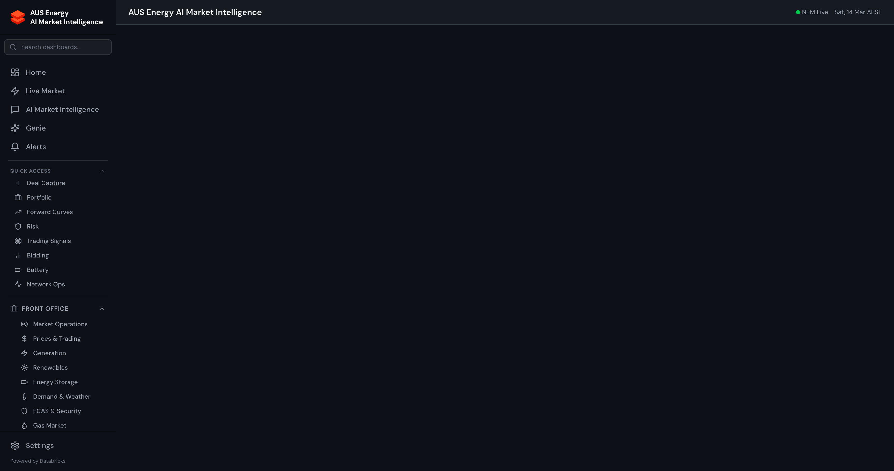
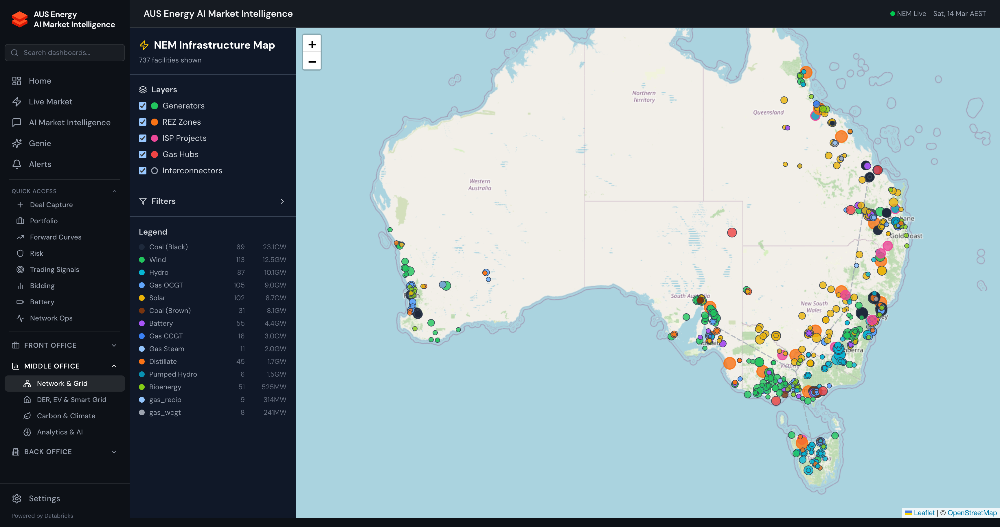

# Back Office Guide

[Back to User Guide](./USER_GUIDE.md)

The Back Office handles settlement processing, regulatory compliance, environmental reporting, network operations, and financial outputs. These workflows are critical for settlement analysts, compliance officers, and finance teams.

---

## Settlement Back Office

The Settlement Back Office is a 6-tab dashboard for AEMO settlement processing, accessible at `/settlement-backoffice`.

### Runs Tab



Track and manage AEMO billing runs across their lifecycle.

**KPI Cards:**
- **Total Runs** — Count of all settlement runs
- **Accepted** — Runs validated and accepted
- **Pending** — Runs awaiting review
- **Net AEMO AUD** — Total settlement amount with variance

**Run Types:**

| Type | Description |
|------|-------------|
| PRELIM | Preliminary settlement (T+5 business days) |
| FINAL | Final settlement (T+18 business days) |
| R1 | First revision (T+20 weeks) |
| R2 | Second revision (T+30 weeks) |
| R3 | Third revision (T+3 years) |

**Run Statuses:** PENDING, VALIDATED, ACCEPTED, DISPUTED, FAILED

**Actions:**
- **+ Create Run** — Manually create a new settlement run entry
- Click any run row to view its charge breakdown
- Filter by run type, status, or date range

### Reconciliation Tab



Compares AEMO settlement amounts against internal calculations:

- **AEMO Settlement Total** — Aggregate AEMO billing amount (e.g., $1.018B)
- **Regional Breakdown** — Per-region comparison with variance and status
  - **MATCH** (green) — Variance within tolerance
  - **BREACH** (red) — Variance exceeds tolerance threshold
- **SRA Residues** — Settlement Residue Auction amounts by interconnector

This tab pulls live data from gold tables and does not require the settlement DDL tables — it works with existing NEMWEB data.

### True-Up Tab



Analyse variance between settlement run versions (PRELIM vs FINAL vs revisions).

**Materiality Threshold:**
- Adjustable slider from $1,000 to $50,000 AUD
- Only runs with variance above the threshold appear in the table

**KPI Cards:**
- **Material Runs** — Count of runs exceeding threshold
- **Total Variance** — Sum of variances for material runs
- **Threshold** — Current materiality setting

**Actions:**
- **Accept** — Auto-accept a run version if variance is below materiality
- Runs are sorted by variance percentage descending

### Disputes Tab



Manage settlement disputes with a full workflow state machine.

**Workflow States:**

```
DRAFT → SUBMITTED → UNDER_REVIEW → ACCEPTED → CLOSED
                                  → REJECTED → DRAFT (re-submission)
```

**KPI Cards:** Count of disputes by workflow state (DRAFT, SUBMITTED, UNDER_REVIEW, ACCEPTED, REJECTED, CLOSED)

**Creating a Dispute:**
1. Click **+ New Dispute**
2. Fill in: Region, Date, Type (ENERGY_AMOUNT, FCAS_AMOUNT, SRA_RESIDUE, ANCILLARY, ADMIN_FEE), AEMO Amount, Variance, Priority (LOW/MEDIUM/HIGH/CRITICAL)
3. Submit — creates in DRAFT state

**Dispute Detail (click a row):**
- Slide-out panel with full dispute details
- **Evidence** — Attach screenshots, CSVs, emails, AEMO responses
- **Timeline** — CDF (Change Data Feed) audit trail showing all state changes with timestamps
- **Transition** — Move dispute to next workflow state

### Finance Tab

GL journal management and settlement statements.

**KPI Cards:**
- **Total Debit** / **Total Credit** — Aggregate journal amounts
- **Accrued (Unposted)** — Journals generated but not yet posted to GL

**GL Journals Table:**
- Period, Type (SETTLEMENT/ACCRUAL/REVERSAL), Account, Charge Type, Region, Debit, Credit, Posted status
- **Post** button to mark individual journals as posted

**How Journals Are Generated:**
1. Navigate to a settlement run in the Runs tab
2. Click **Generate Journals** (or call `POST /api/settlement/journals/generate`)
3. The system uses GL mappings to create double-entry journal lines:
   - Debit: Purchase/cost account per charge type
   - Credit: Payable account (AEMO Payable)
4. Review in Finance tab, then Post to mark as sent to GL

**Settlement Statement:**
- Select a date range to generate a settlement statement
- Shows totals by charge type, region, and GL account

**Accruals:**
- Month-end accrual calculation based on estimated vs actual settlement amounts

### GL Config Tab



Chart-of-accounts configuration mapping AEMO charge types to GL accounts.

**Default Mappings (7 charge types):**

| Charge Type | Debit Code | Debit Name | Credit Code | Credit Name |
|-------------|-----------|------------|-------------|-------------|
| ENERGY | 4100 | Energy Purchases | 2100 | AEMO Energy Payable |
| FCAS_RAISE | 4200 | FCAS Raise Costs | 2100 | AEMO FCAS Payable |
| FCAS_LOWER | 4210 | FCAS Lower Costs | 2100 | AEMO FCAS Payable |
| SRA_RESIDUE | 4300 | SRA Residue Revenue | 1200 | SRA Receivable |
| ANCILLARY | 4400 | Ancillary Service Costs | 2100 | AEMO Ancillary Payable |
| RERT | 4500 | RERT Costs | 2100 | AEMO RERT Payable |
| ADMIN | 4600 | AEMO Admin Fees | 2100 | AEMO Admin Payable |

**Actions:**
- **+ Add Mapping** — Create a new GL mapping for a charge type
- **Deactivate** — Soft-delete a mapping (sets `is_active = false`)
- Each mapping shows Active/Inactive status badge

---

## Compliance



Regulatory compliance monitoring and reporting:

- **NEM Rules compliance** — Tracking against AEMO market rules
- **Bidding compliance** — Rebid justification monitoring, good faith bidding
- **Participant obligations** — Registration conditions, prudential requirements
- **Regulatory reform tracker** — Active and upcoming NEM rule changes
- **Audit trail** — Full audit log of compliance-relevant actions

---

## Network Operations



Network infrastructure monitoring and planning:

- **Network constraints** — Active binding constraints with shadow prices
- **Outage management** — Planned and forced outage schedules
- **NEM facility map** — Interactive Leaflet map with 742 generation facilities
- **Network assets** — Transmission and distribution asset registers
- **DER fleet management** — Distributed Energy Resource aggregation and dispatch

### NEM Facility Map



Interactive map showing all 742 registered generation facilities:
- Colour-coded by fuel type (green = renewables, grey = thermal, blue = hydro)
- Click a facility for details: capacity, fuel type, region, dispatch data
- Filter by region, fuel type, or capacity range

---

## Environmentals

Environmental and sustainability analytics:

- **Carbon emissions intensity** — Real-time grid emissions by region
- **Renewable energy certificates** — LGC, STC tracking and pricing
- **Safeguard mechanism** — Baseline tracking and ACCU requirements
- **ESG reporting** — Sustainability metrics and disclosures
- **Net zero tracking** — Decarbonisation pathway progress

---

## Reports

Automated reporting and data export:

- **Market briefs** — AI-generated daily market narratives (auto-refresh if stale > 6h)
- **Settlement reports** — Period-end settlement summaries
- **Compliance reports** — Regulatory submission preparation
- **Custom exports** — CSV/Excel export of any dashboard data

---

[Back to User Guide](./USER_GUIDE.md) | [Front Office Guide](./guide-front-office.md) | [Middle Office Guide](./guide-middle-office.md)
