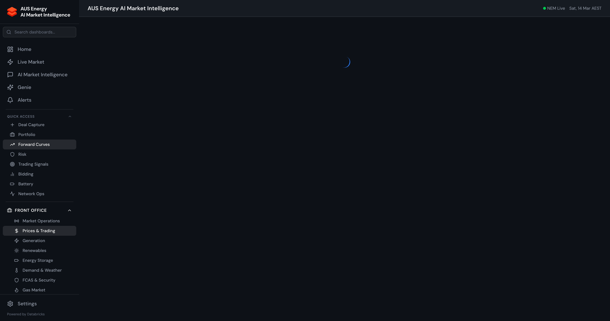
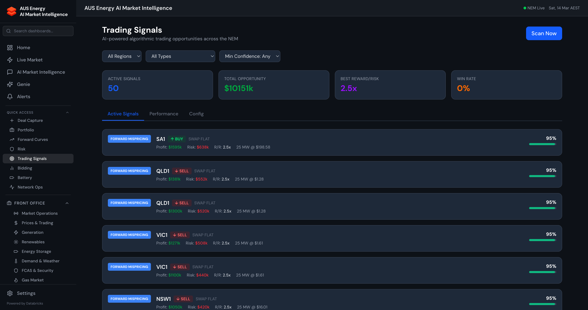

# Front Office Guide

[Back to User Guide](./USER_GUIDE.md)

The Front Office section contains market-facing analytics dashboards used by traders, analysts, and market operations teams. Access these via the **Front Office** group in the sidebar.

---

## Market Operations

Category page aggregating operational market dashboards including real-time NEM overview, market events timeline, AEMO interventions, and dispatch interval analysis.

Key pages:
- **NEM Real-Time Overview** — Live regional prices, generation, demand, interconnectors
- **Market Events Timeline** — Historical market events with severity classification
- **AEMO Interventions** — Directions, RERT activations, reliability events
- **Dispatch Interval Analysis** — 5-minute granularity price/volume analysis

---

## Prices & Trading

Core trading analytics for spot price analysis, futures, and forward markets.

### Spot Price Analytics
- **Price heatmap** — 5-minute regional prices with spike highlighting
- **Price duration curve** — Sorted price distribution showing baseload vs peak economics
- **Volatility regime analysis** — Statistical classification of calm/moderate/volatile/extreme regimes
- **Price spike post-event analysis** — Root cause investigation of significant price events

### Futures & Forward Curves

- **ASX energy futures** — Base, peak, and cap futures across quarterly and calendar contracts
- **Forward curve construction** — Bootstrapped forward curves from futures settlement prices
- **Term structure analysis** — Contango/backwardation patterns, seasonal spreads
- **Basis risk** — Futures vs spot basis tracking by region

### Trading Signals

Algorithmic signal engine generating 8 types of trading signals with traceable rationale:

| Signal Type | Description |
|-------------|-------------|
| Price Spike | ML-predicted spike probability > 70% |
| Mean Reversion | Price significantly above/below rolling mean |
| Interconnector Arbitrage | Cross-regional price spread opportunity |
| Demand Surge | Demand exceeding forecast by > 5% |
| Wind Ramp | Rapid wind generation change (up or down) |
| Solar Cliff | Evening solar ramp-down creating price uplift |
| FCAS Co-optimisation | FCAS/energy spread opportunity |
| Constraint Binding | Network constraint creating regional price separation |

Each signal includes:
- **Confidence score** (0-100%)
- **Traceable rationale** explaining why the signal was generated
- **Recommended action** (buy/sell/hedge/monitor)
- **Time horizon** and expiry

---

## Generation

Analytics for the generation fleet across all fuel types:

- **Generation by fuel type** — Stacked area charts showing fuel mix evolution
- **Facility-level output** — Individual generator performance tracking
- **Capacity factors** — Actual vs nameplate utilisation by technology
- **Outage impact analysis** — Generation lost due to planned/forced outages
- **Merit order analysis** — Dispatch stack showing marginal generator

---

## Renewables

Dedicated analytics for renewable energy:

- **Wind generation** — Farm-level output, forecast accuracy, ramp events
- **Solar generation** — Rooftop + utility scale, clear-sky ratio, curtailment
- **Renewable curtailment** — Quantifying spilled energy by cause (constraint, economics, voltage)
- **REZ development tracker** — ISP Renewable Energy Zone project pipeline
- **Capacity investment signals** — Technology-specific LRMC vs forward price analysis

---

## Energy Storage

Battery and pumped hydro analytics:

- **Battery dispatch** — Charge/discharge cycles, state of charge, round-trip efficiency
- **Arbitrage revenue** — Actual vs optimal revenue stacking (energy + FCAS)
- **Revenue optimisation** — Optimal dispatch schedule based on price forecasts
- **Technology comparison** — Li-ion vs flow battery vs pumped hydro economics
- **Degradation tracking** — Cycle count, capacity fade, warranty metrics

---

## Demand & Weather

Weather-driven demand analytics:

- **Demand forecasting** — ML forecast vs actual with accuracy metrics (< 3% MAPE target)
- **Weather correlation** — Temperature, wind, solar irradiance impact on demand
- **Demand response** — DR activation events, load reduction verification
- **Minimum demand events** — Duck curve analysis, behind-the-meter solar impact
- **EV fleet integration** — Charging load forecasts and grid impact scenarios

---

## FCAS & Security

Frequency Control Ancillary Services analytics:

- **FCAS prices** — Raise/lower regulation and contingency prices by region
- **FCAS enablement** — Generator participation and availability
- **System frequency** — Real-time frequency deviation monitoring
- **Inertia tracking** — System inertia levels and minimum requirements
- **Causer pays** — FCAS cost allocation factors by participant

---

## Gas Market

East coast and spot gas market analytics:

- **Gas hub prices** — Wallumbilla, STTM hubs (Sydney, Brisbane, Adelaide)
- **Pipeline flows** — East coast gas pipeline utilisation
- **Gas-powered generation economics** — Spark spread analysis, heat rate tracking
- **LNG export impact** — Domestic vs export price linkage
- **Gas supply adequacy** — Storage levels, production outlook

---

[Back to User Guide](./USER_GUIDE.md) | [Middle Office Guide](./guide-middle-office.md) | [Back Office Guide](./guide-back-office.md)
