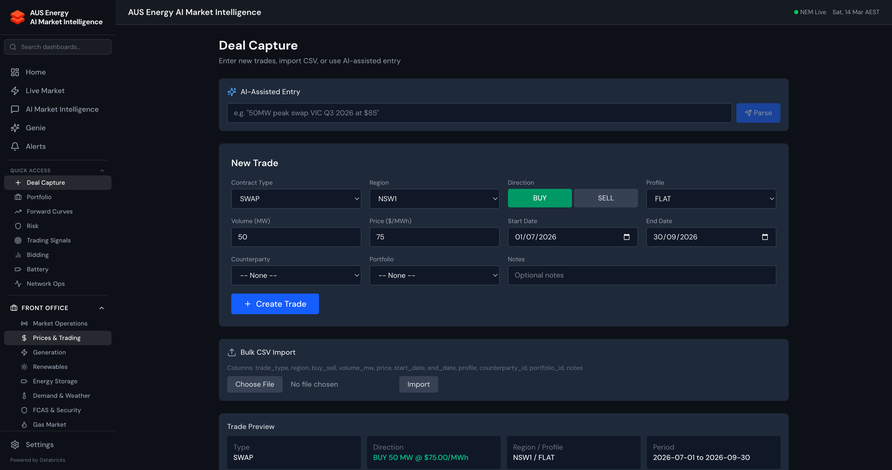
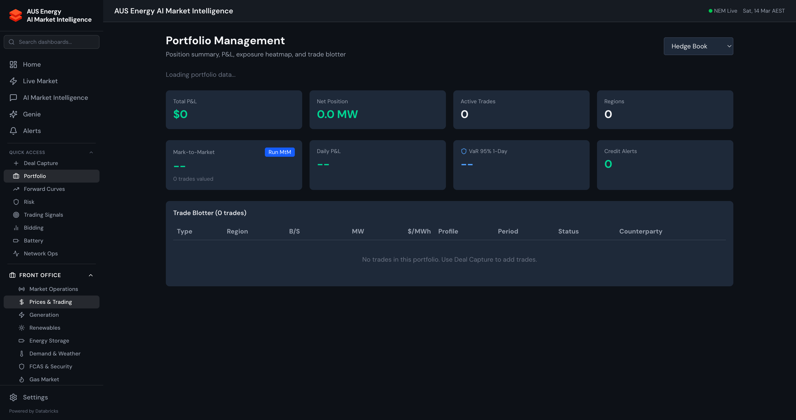
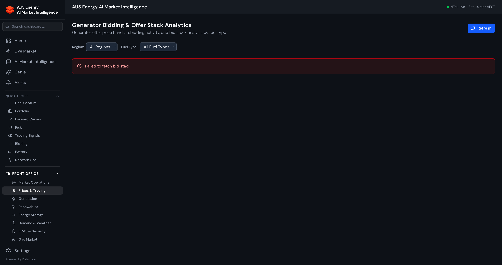

# Middle Office Guide

[Back to User Guide](./USER_GUIDE.md)

The Middle Office supports trade lifecycle management, portfolio analytics, risk quantification, and trading strategy. These are the primary tools for trading desks, risk managers, and portfolio analysts.

---

## Deal Capture

End-to-end trade entry with integrated credit and approval workflows.

### Creating a Trade

1. Select **Trade Type** — SWAP, CAP, FLOOR, COLLAR, OPTION, PHYSICAL
2. Choose **Direction** — BUY or SELL
3. Enter trade details:
   - **Counterparty** — Select from registered counterparties
   - **Region** — NEM region (NSW1, VIC1, QLD1, SA1, TAS1)
   - **Volume (MW)** — Contracted megawatts
   - **Strike Price ($/MWh)** — Contract price
   - **Start/End Date** — Contract tenor
4. Click **Submit Trade**

### Pre-Trade Credit Check

When you enter a counterparty and notional value, a real-time credit indicator appears:

| Indicator | Meaning |
|-----------|---------|
| Green shield | Credit utilisation < 80% — trade proceeds |
| Amber shield | 80-90% utilisation — warning, trade allowed |
| Red shield | > 100% utilisation — trade blocked |

The credit check runs automatically with 800ms debounce as you type.

### Approval Workflows

High-value trades trigger maker-checker approval:

| Rule | Threshold | Approver |
|------|-----------|----------|
| High-Value Trade | > $500K notional | Risk Manager |
| Very High-Value Trade | > $2M notional | Trading Head |
| Large Amendment | > $1M amendment | Risk Manager |

When triggered, the trade enters `PENDING_APPROVAL` status. Approvers review in the Trade Blotter's Pending Approvals queue.

---

## Portfolio

Portfolio-level analytics with mark-to-market and P&L:

### KPI Summary Row

| KPI | Description |
|-----|-------------|
| **Mark-to-Market** | Total portfolio MtM in AUD (click "Run MtM" to refresh) |
| **Daily P&L** | Today's profit/loss vs prior close |
| **VaR 95% 1-Day** | Value-at-Risk at 95% confidence |
| **Credit Alerts** | Count of counterparties at WARNING/CRITICAL utilisation |

### Portfolio Views

- **Position summary** — Net long/short by region, fuel type, contract type
- **Trade blotter** — All trades with status, dates, MtM, P&L
- **P&L attribution** — Waterfall chart breaking P&L into price, volume, curve, and theta components
- **Exposure aging** — Forward exposure by tenor bucket (1M, 3M, 6M, 1Y, 2Y+)

### Trade Blotter — Approvals

The **Pending Approvals** section shows trades awaiting maker-checker sign-off:
- Trade details (counterparty, region, volume, price, notional)
- Rule matched and required approver role
- **Approve** or **Reject** buttons with reason input
- Maker-checker enforced: approver cannot be the submitter

---

## Forward Curves

Construction and analysis of energy forward curves:

- **Curve builder** — Bootstrap forward curves from ASX futures settlement prices
- **Curve comparison** — Overlay multiple dates to see curve shifts
- **Seasonal decomposition** — Base, peak, off-peak shape factors
- **Basis curves** — Regional basis differentials (e.g., NSW-VIC spread)
- **Curve history** — Time series of specific tenor points

### How Forward Curves Are Built

1. ASX Energy Futures EOD data is ingested daily
2. Settlement prices are interpolated across the curve
3. Shape factors (peak/off-peak) are applied from historical patterns
4. Curves are stored in `gold.forward_curves` for downstream use (MtM, PPA valuation, signals)

---

## Risk Management

Comprehensive risk analytics across market, credit, and operational risk:

### Market Risk

- **Value-at-Risk (VaR)** — Historical simulation VaR at 95% and 99% confidence
- **Expected Shortfall (CVaR)** — Tail risk beyond VaR threshold
- **Greeks** — Delta, Gamma, Vega, Theta per position and portfolio
- **Stress testing** — Scenario analysis (price spike, demand surge, renewable drought)

### Credit Risk

- **Counterparty exposure** — Current and potential future exposure
- **Credit utilisation** — Usage vs limit with amber/red thresholds
- **Exposure aging** — Time-bucketed exposure profile
- **Credit check API** — Real-time pre-trade credit validation

### PPA Valuation Engine

Monte Carlo valuation for Power Purchase Agreements:

1. Navigate to Risk > PPA Valuation
2. Enter parameters:
   - Strike price ($/MWh)
   - Term (years)
   - Technology (solar_utility, wind)
   - Region
   - Volume (MW)
   - Escalation rate
3. Click **Run Valuation**

Returns: Expected NPV, P10/P50/P90, breakeven strike, capture price discount, annual cashflows.

*Algorithm: 1000 Monte Carlo simulations with forward curve bootstrap, hourly generation shape, price/generation uncertainty sampling, discounted cashflow NPV.*

---

## Bidding

Generator bidding analytics and optimisation:

- **Bid stack visualisation** — Regional dispatch stack with price bands
- **Rebid analysis** — Rebid frequency, timing, and price band shifts
- **Bidding behaviour** — Generator-level bidding patterns and strategy classification
- **Market concentration** — HHI index and pivotal supplier analysis
- **Bid optimisation** — Recommended bid strategies based on forecast conditions

---

## Battery Optimisation

Battery energy storage dispatch optimisation:

- **Optimal dispatch schedule** — Price forecast-driven charge/discharge timing
- **Revenue stacking** — Co-optimised energy + FCAS revenue
- **State of charge management** — Cycle optimisation to minimise degradation
- **Arbitrage analysis** — Historical and forecast spread analysis
- **Fleet management** — Multi-asset portfolio optimisation

---

[Back to User Guide](./USER_GUIDE.md) | [Front Office Guide](./guide-front-office.md) | [Back Office Guide](./guide-back-office.md)
