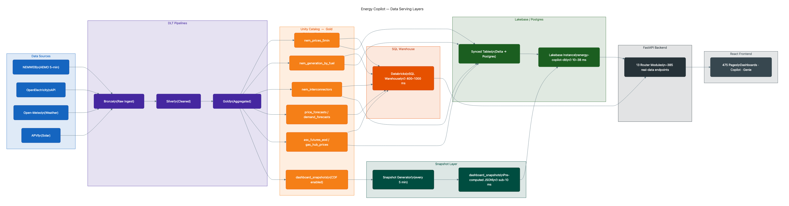
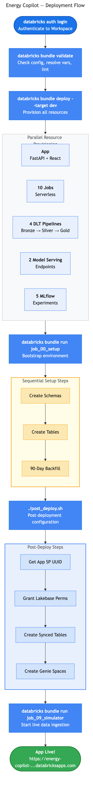
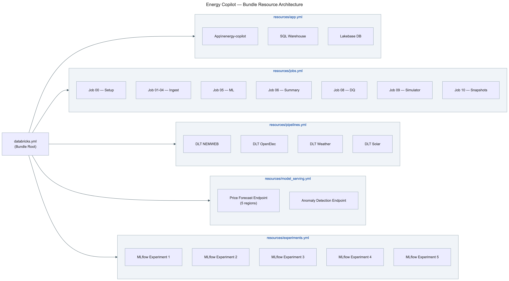

# AUS Energy Copilot


📖 **[Full Documentation →](https://sourabhghose.github.io/databricks-energy-ai-intelligence)**  &nbsp;|&nbsp;  🚀 **[Live App →](https://energy-copilot-7474645691011751.aws.databricksapps.com)**

AUS Energy Copilot is an AI-powered Australian National Electricity Market (NEM) intelligence platform deployed on Databricks. It ingests live 5-minute dispatch data from AEMO NEMWEB, OpenElectricity, Open-Meteo, APVI rooftop solar, AER retail tariffs, CER LGC registry, and AEMO ISP data into a Unity Catalog Medallion lakehouse, trains 21 LightGBM and IsolationForest models for price/demand/wind/solar forecasting and anomaly detection, and surfaces everything through a FastAPI backend and React 18 frontend. An agentic AI copilot backed by Claude Sonnet 4.6 with 10 FMAPI tools (including deal capture and forward curves) answers free-form market questions in real time, while 6 Databricks Genie Spaces enable natural-language SQL analytics over the full historical dataset. The entire platform deploys from scratch with `databricks bundle deploy` + one setup job.

---

## Architecture

```
┌─────────────────────────────────────────────────────────────────┐
│                    AUS Energy Copilot                           │
├──────────────┬──────────────┬──────────────┬────────────────────┤
│   NEMWEB     │ OpenElec API │  Open-Meteo  │   APVI Rooftop     │
│  (5-min NEM) │  (gen data)  │  (weather)   │   Solar (15-min)   │
└──────┬───────┴──────┬───────┴──────┬───────┴────────┬───────────┘
       │              │              │                │
       ▼              ▼              ▼                ▼
┌─────────────────────────────────────────────────────────────────┐
│              Databricks Delta Lake (Unity Catalog)              │
│   Bronze (raw) → Silver (cleaned) → Gold (aggregated+features) │
│   Catalog: energy_copilot_catalog | 40+ Delta tables | DLT     │
└──────────────────────┬──────────────────────────────────────────┘
                       │
        ┌──────────────┼──────────────┐
        ▼              ▼              ▼
┌──────────────┐ ┌──────────────┐ ┌──────────────────────────┐
│  ML Models   │ │  AI Copilot  │ │   Databricks Genie       │
│ LightGBM ×20 │ │ Claude 4.6   │ │   6 Spaces (NL→SQL)      │
│ IsoForest ×1 │ │ 7 FMAPI tools│ │                          │
│ MLflow UC    │ │ VS + RAG     │ │                          │
└──────┬───────┘ └──────┬───────┘ └──────────────────────────┘
       │                │
       ▼                ▼
┌─────────────────────────────────────────────────────────────────┐
│              FastAPI Backend (15 router modules)                │
│   Lakebase (10-38ms) ← Synced Tables ← Gold ← SQL WH (400ms) │
│   Rate limiting · SSE streaming · Dashboard snapshots           │
└──────────────────────┬──────────────────────────────────────────┘
                       │
                       ▼
┌─────────────────────────────────────────────────────────────────┐
│                React 18 + Vite 5 Frontend                       │
│   479 pages · Copilot · Genie · Dashboards · Deal Capture       │
│   Recharts · Tailwind · React Router v6                         │
└─────────────────────────────────────────────────────────────────┘
```

### Data Serving Layers

The app uses a tiered data serving architecture for optimal latency:



| Layer | Latency | Description |
|-------|---------|-------------|
| **Lakebase (Postgres)** | 10–38ms | Synced Tables replicate Gold Delta tables into a managed Postgres instance. Primary serving path. |
| **Dashboard Snapshots** | <10ms | Pre-computed JSON payloads stored in `dashboard_snapshots` table, synced to Lakebase. |
| **SQL Warehouse** | 400–1000ms | Fallback path querying Gold tables directly via `databricks-sql-connector`. |
| **In-Memory Cache** | <1ms | Thread-safe TTL cache (10–30s) avoids repeated queries within the same window. |

---

## Quick Start — Databricks Asset Bundle Deploy

The entire platform deploys with a single `databricks bundle deploy` command. No manual notebook uploads, no workspace file management, no hardcoded configuration.



### Prerequisites

| Requirement | Notes |
|---|---|
| Databricks Workspace | Serverless-enabled, Unity Catalog active |
| Databricks CLI | v0.209.0+ (`brew tap databricks/tap && brew install databricks`) |
| Node.js + npm | For frontend build (`brew install node`) |
| Databricks Apps | Enabled on the workspace |

### Deploy in 4 Steps

```bash
# Step 1 — Authenticate
databricks auth login https://your-workspace.cloud.databricks.com --profile=my-profile

# Step 2 — Deploy all resources (App, Jobs, Pipelines, Serving Endpoints, Experiments)
databricks bundle deploy --target dev --profile=my-profile

# Step 3 — One-time setup: create schemas, tables, run 90-day historical backfill
databricks bundle run job_00_setup --target dev --profile=my-profile

# Step 4 — Post-deploy: Lakebase permissions, Synced Tables, Genie Spaces
./post_deploy.sh my-profile dev
```

To start the live data simulator (writes fresh NEM data every 30 seconds):

```bash
databricks bundle run job_09_simulator --target dev --profile=my-profile
```

### What Gets Deployed

`databricks bundle deploy` creates all resources in a single operation:



| Resource | Count | Description |
|----------|-------|-------------|
| **Databricks App** | 1 | FastAPI backend + React frontend, with SQL Warehouse and Lakebase resources |
| **Jobs** | 10 | Ingest (NEMWEB, OpenElec, Weather, Solar), ML Forecast, Market Summary, Data Quality, Simulator, Snapshots, Setup |
| **DLT Pipelines** | 4 | Serverless DLT: NEMWEB, OpenElectricity, Weather, Solar |
| **Model Serving** | 2 | Price Forecast (5 regional models) + Anomaly Detection |
| **MLflow Experiments** | 5 | Price, Demand, Wind, Solar, Anomaly |

### Validate Before Deploying

```bash
databricks bundle validate --target dev --profile=my-profile
```

This checks all YAML syntax, variable references, and resource definitions without making any changes.

### Environment Variables (Bundle-Managed)

All environment variables are set automatically by the bundle via `resources/app.yml`. No manual configuration needed:

| Variable | Set By | Description |
|----------|--------|-------------|
| `DATABRICKS_CATALOG` | Bundle | Unity Catalog name (default: `energy_copilot_catalog`) |
| `LAKEBASE_INSTANCE_NAME` | Bundle | Lakebase Postgres instance (default: `energy-copilot-db`) |
| `LAKEBASE_DATABASE` | Bundle | Lakebase database name (default: `energy_copilot_db`) |
| `VS_ENDPOINT_NAME` | Bundle | Vector Search endpoint for RAG |
| `VS_INDEX_NAME` | Bundle | Vector Search index for AEMO documents |
| `PGHOST`, `PGPORT`, `PGUSER` | Apps Runtime | Auto-injected by Databricks Apps when Lakebase resource is registered |

### Bundle Variables

Customize deployment via bundle variables:

```bash
# Deploy with custom catalog name
databricks bundle deploy --target dev --var="catalog=my_custom_catalog"

# Deploy to production
databricks bundle deploy --target prod --var="notification_email=ops@mycompany.com"
```

| Variable | Default | Description |
|----------|---------|-------------|
| `catalog` | `energy_copilot_catalog` | Unity Catalog name |
| `lakebase_instance_name` | `energy-copilot-db` | Lakebase instance |
| `lakebase_database` | `energy_copilot_db` | Lakebase database |
| `warehouse_id` | (lookup) | SQL Warehouse ID (auto-discovered) |
| `app_name` | `energy-copilot` | Databricks App name |
| `vs_endpoint_name` | `energy-copilot-vs-endpoint` | Vector Search endpoint |
| `notification_email` | (empty) | Job failure notification email |

---

## Project Structure

```
energy-copilot/
├── databricks.yml                # Bundle config (variables + includes)
├── resources/
│   ├── app.yml                   # Databricks App (FastAPI + React + Lakebase)
│   ├── jobs.yml                  # 10 serverless jobs (ingest, ML, simulator, setup)
│   ├── pipelines.yml             # 4 serverless DLT pipelines
│   ├── model_serving.yml         # 2 model serving endpoints
│   └── experiments.yml           # 5 MLflow experiments
├── app/
│   ├── main.py                   # FastAPI backend (~199 lines, 15 router includes)
│   ├── app.yaml                  # Databricks Apps config (command only)
│   ├── requirements.txt          # Python dependencies
│   ├── routers/
│   │   ├── shared.py             # Foundation: logging, cache, SQL, Lakebase, NEM constants
│   │   ├── home.py               # Home dashboard endpoints (prices, generation, interconnectors)
│   │   ├── dashboards.py         # Multi-dashboard endpoints (carbon, gas, region comparisons)
│   │   ├── sidebar.py            # Sidebar data (weather, BESS, DR, alerts, merit order)
│   │   │   ├── copilot.py            # AI Copilot (Claude Sonnet 4.6 + 10 FMAPI tools + RAG)
│   │   ├── genie.py              # Genie AI/BI proxy (6 spaces, NL→SQL)
│   │   ├── deals.py              # Deal Capture, Portfolio, Trade Blotter CRUD
│   │   ├── curves.py             # Forward curve construction (ASX bootstrap)
│   │   ├── batch_forecasting.py  # Price/demand forecast endpoints
│   │   ├── batch_bidding.py      # Bid stack, withholding, market concentration
│   │   ├── batch_futures_hedging.py  # ASX futures, carbon, SRA, hedging
│   │   ├── spike_analysis.py     # Spike detection and analysis
│   │   ├── stubs.py              # Illustrative endpoints (hydrogen, regulatory)
│   │   └── auto_stubs.py         # 305 auto-generated real-data endpoints
│   │   └── risk.py               # Risk dashboard (VaR, CVaR, exposure)
│   │   └── market_events.py      # Market events feed
│   └── frontend/                 # React 18 + Vite 5 SPA (479 pages)
├── pipelines/
│   ├── 01_nemweb_ingest.py       # DLT Bronze→Silver→Gold (prices, gen, interconnectors)
│   ├── 02_openelec_ingest.py     # OpenElectricity API ingest
│   ├── 03_weather_ingest.py      # Open-Meteo NWP weather ingest
│   ├── 04_solar_ingest.py        # APVI rooftop solar ingest
│   ├── 05_forecast_pipeline.py   # ML inference (20 LightGBM + IsolationForest)
│   ├── 06_market_summary.py      # Daily market narrative (Claude AI)
│   ├── 08_data_quality_report.py # Daily data quality checks
│   ├── 09_aer_tariff_ingest.py   # AER CDR retail tariff ingest (+ seed fallback)
│   ├── 09_dashboard_snapshot_generator.py  # Pre-compute dashboard JSON
│   ├── 10_opennem_facility_timeseries.py   # OpenNEM facility generation (+ seed fallback)
│   ├── 11_cer_lgc_ingest.py      # CER LGC registry + spot prices (+ seed fallback)
│   ├── 11_grant_lakebase_perms.py          # Lakebase SP permissions
│   ├── 12_isp_data_ingest.py     # AEMO ISP project tracker + REZ (+ seed fallback)
│   └── 12_recreate_synced_tables_continuous.py  # Synced Table creation
├── setup/
│   ├── 00_create_catalog.sql     # Unity Catalog DDL
│   ├── 01_create_schemas.sql     # Schema definitions
│   ├── 02_create_tables.py       # Table DDL + SP grants (authoritative)
│   ├── 04_create_genie_spaces.py # Genie AI/BI space creation
│   ├── 10_nem_simulator.py       # Live data simulator (writes every 30s)
│   ├── 11_historical_backfill.py # 90-day historical data generator
│   └── 13_seed_deal_data.py      # Seed trades, counterparties, portfolios
├── post_deploy.sh                # Post-deploy: Lakebase + Genie setup
├── deploy.sh                     # DEPRECATED — use bundle deploy
├── models/                       # ML model packages (price, demand, wind, solar, anomaly)
├── agent/                        # Copilot agent tools + RAG
├── tests/                        # pytest suite
└── docs/
    ├── DEPLOYMENT.md             # Detailed deployment guide
    ├── PRD.md                    # Product requirements (Phases 1-4)
    └── images/                   # Architecture diagrams
```

---

## Data Pipeline

### Simulated Mode (default)

The deploy script provisions a **NEM Market Data Simulator** that generates realistic 5-minute dispatch data for all 5 NEM regions. No external API keys or live data feeds are required.

| Component | Description |
|-----------|-------------|
| **Historical Backfill** | `setup/11_historical_backfill.py` — Generates 90 days of historical data across 9 gold tables on first deploy |
| **Live Simulator** | `setup/10_nem_simulator.py` — Runs as a Databricks Job, writing fresh data every 30 seconds |

The simulator models realistic patterns: diurnal demand curves, solar peak at midday, wind variability, coal baseload, gas peaking, battery charge/discharge cycles, interconnector flows, and occasional price spikes.

### Gold Tables

| Table | Description | Update Frequency |
|-------|-------------|------------------|
| `nem_prices_5min` | Spot prices by region | Every 30s |
| `nem_generation_by_fuel` | Generation mix (7 fuel types x 5 regions) | Every 30s |
| `nem_interconnectors` | Interconnector flows (5 links) | Every 30s |
| `demand_actuals` | Demand and rooftop solar | Every 30s |
| `weather_nem_regions` | Temperature, wind, solar radiation | Every 30s |
| `anomaly_events` | Price spikes and negative price events | On occurrence |
| `price_forecasts` | 3-horizon price forecasts | Every 5 min |
| `demand_forecasts` | 3-horizon demand forecasts | Every 5 min |
| `nem_daily_summary` | Daily regional summaries | Daily |
| `dashboard_snapshots` | Pre-computed dashboard JSON | Every 5 min |
| `asx_futures_eod` | ASX energy futures | Daily |
| `gas_hub_prices` | Gas hub prices (5 hubs) | Daily |
| `emissions_factors` | NGA emission factors by fuel | Quarterly |
| `retail_tariffs` | AER CDR retail energy plans | Daily |
| `tariff_components` | Usage/supply/demand rate components | Daily |
| `facility_generation_ts` | Facility-level power timeseries | Every 30 min |
| `lgc_registry` | CER LGC creation volumes by station | Quarterly |
| `lgc_spot_prices` | LGC spot prices (CER/broker) | Quarterly |
| `isp_projects` | AEMO ISP project tracker | Annual |
| `isp_capacity_outlook` | ISP capacity by scenario/year/fuel | Annual |
| `rez_assessments` | REZ development status and scores | Annual |
| `forward_curves` | ASX-bootstrapped forward curves | On snapshot |
| `trades` | Energy trade records (CRUD) | Real-time |
| `counterparties` | Trading counterparties | Real-time |
| `portfolios` | Trading portfolios | Real-time |

### Live Data Sources (optional)

| Source | URL | Refresh | Notes |
|--------|-----|---------|-------|
| **NEMWEB** | `nemweb.com.au/REPORTS/CURRENT/` | 5 min | Primary dispatch data (prices, generation, interconnectors, FCAS); no API key required |
| **OpenElectricity** | `api.openelectricity.org.au/v4` | Hourly | Cleaner REST API; facility-level timeseries and historical backfill |
| **Open-Meteo** | `api.open-meteo.com` | Hourly | BOM ACCESS-G gridded NWP (temperature, wind speed, solar irradiance); free for non-commercial use |
| **APVI** | `pv-map.apvi.org.au/api` | 15 min | Rooftop solar generation by postcode aggregated to NEM region |
| **AER CDR** | `cdr.energymadeeasy.gov.au` | Daily | Retail energy plans via Consumer Data Right API; no auth required |
| **CER** | `cer.gov.au` | Quarterly | LGC registry + spot prices via CSV downloads |
| **AEMO ISP** | `aemo.com.au/.../isp` | Annual | ISP 2024 project tracker, capacity outlook, REZ assessments |

---

## ML Models

| Model | Regions | Algorithm | MAPE Target | Features |
|-------|---------|-----------|-------------|----------|
| Price Forecast | 5 (NSW1, QLD1, VIC1, SA1, TAS1) | LightGBM | <12% | 30+ features incl FCAS, interconnectors, volatility regime, spike history |
| Demand Forecast | 5 | LightGBM | <3% | Temperature (current + NWP +1h/+4h), time flags, 12-interval demand lags |
| Wind Forecast | 5 | LightGBM | <8% | Wind speed lags 1-12, 4h rolling stats, ramp rate, capacity factor |
| Solar Forecast | 5 | LightGBM | <10% | Sun angle proxy, seasonality sin/cos, cloud proxy, night-interval excluded |
| Anomaly Detection | NEM-wide | IsolationForest + rules | F1 >0.7 | Price/demand rolling mean/std, spike rules (>$5000), negative price (<-$100), regional spread |

All models are registered in MLflow Model Registry (Unity Catalog) under the `energy_copilot.ml` schema with a `production` alias.

---

## AI Copilot

The Copilot (`/copilot`) uses **Claude Sonnet 4.6 via Databricks Foundation Model API** with two modes:

1. **Context-Stuffing**: Pre-fetches 16 live data sources (prices, spikes, interconnectors, generation mix, volatility, BESS, alerts, DR, forecasts, weather, participants, price trend, renewable %, congestion) and injects into the system prompt.

2. **FMAPI Tool Calling**: 10 tools that the LLM can invoke dynamically with a multi-turn loop (max 5 rounds):

| Tool | Description | Data Source |
|------|-------------|-------------|
| `query_spot_prices` | NEM RRP by region | `gold.nem_prices_5min` |
| `query_generation_mix` | Fuel type breakdown | `gold.nem_generation_by_fuel` |
| `query_interconnectors` | Flows, limits, congestion | `gold.nem_interconnectors` |
| `query_price_forecasts` | Predicted RRP + confidence | `gold.price_forecasts` |
| `query_weather` | Temperature, wind, solar | `gold.weather_nem_regions` |
| `query_demand_forecasts` | Predicted demand MW | `gold.demand_forecasts` |
| `search_market_rules` | NEM rules/procedures RAG | Vector Search index |
| `create_trade` | Create energy trade from NL | `gold.trades` |
| `get_portfolio_position` | Portfolio position lookup | `gold.portfolios` |
| `get_forward_curve` | ASX-bootstrapped curve | `gold.forward_curves` |

## Genie AI/BI Spaces

The Genie page (`/genie`) provides 6 Databricks AI/BI Genie spaces for natural-language SQL analytics:

| Space | Description | Tables |
|-------|-------------|--------|
| NEM Spot Market | Spot prices, demand, spikes, anomalies | `nem_prices_5min`, `anomaly_events`, `demand_actuals` |
| Generation & Renewables | Fuel mix, emissions, capacity factors | `nem_generation_by_fuel`, `nem_daily_summary` |
| Network & Interconnectors | Flows, congestion, constraints | `nem_interconnectors`, `nem_constraints_active` |
| Forecasting & Weather | Price/demand forecasts, weather | `price_forecasts`, `demand_forecasts`, `weather_nem_regions` |
| Bidding & Trading | Generator fleet, market concentration | `nem_facilities`, `nem_generation_by_fuel`, `nem_prices_5min` |
| Storage & Battery | Battery fleet, arbitrage, grid integration | `nem_facilities`, `nem_generation_by_fuel`, `nem_interconnectors` |

---

## API Endpoints

Key endpoints wired to Unity Catalog gold tables (with mock fallback):

| Method | Path | Gold Table | Description |
|--------|------|------------|-------------|
| `GET` | `/health` | — | Service health, SQL connection status |
| `GET` | `/api/health/datasource` | — | Lakebase connection status + query stats |
| `GET` | `/api/prices/latest` | `nem_prices_5min` | Latest spot prices for all 5 NEM regions |
| `GET` | `/api/prices/history` | `nem_prices_5min` | 24h of 5-minute price points for a region |
| `GET` | `/api/prices/volatility` | `nem_prices_5min` | 24h volatility metrics |
| `GET` | `/api/interconnectors` | `nem_interconnectors` | Interconnector flows, limits, congestion |
| `GET` | `/api/forecasts` | `price_forecasts` | Multi-horizon price forecasts with confidence |
| `POST` | `/api/chat` | All (via context) | SSE-streaming copilot chat (Claude Sonnet 4.6) |
| `GET` | `/api/genie/spaces` | — | List 6 Genie AI/BI spaces |

All endpoints include TTL caching (10-30s) and automatically fall through to mock data when the SQL connection is unavailable. Response headers `X-Data-Source` and `X-Query-Ms` indicate which backend served the data and latency.

---

## Local Development

```bash
# Run backend in mock mode (no Databricks needed)
cd app && uvicorn main:app --reload --port 8000

# Run frontend
cd app/frontend && npm install && npm run dev
# Open http://localhost:5173
```

All endpoints fall through to realistic mock data when running locally outside Databricks, so the full UI is usable for development without any cloud credentials.

### Running Tests

```bash
pytest tests/ -v -k "not integration"
pytest tests/ --cov=app --cov=agent --cov=models -v
```

---

## Deployment

### Bundle Deploy (Recommended)

See the [Quick Start](#quick-start--databricks-asset-bundle-deploy) section above, or the detailed guide at [`docs/DEPLOYMENT.md`](docs/DEPLOYMENT.md).

### Legacy Deploy (Deprecated)

The old `deploy.sh` script is deprecated. It still works if you set `FORCE_LEGACY_DEPLOY=1`:

```bash
FORCE_LEGACY_DEPLOY=1 ./deploy.sh my-profile
```

But the bundle deploy approach is strongly recommended as it:
- Deploys everything in a single command
- Manages all resources declaratively (jobs, pipelines, app, serving endpoints)
- Uses serverless compute (no cluster management)
- Supports multiple targets (dev/prod) with variable overrides
- Is idempotent and version-controlled

---

## License

MIT — see [LICENSE](LICENSE).
