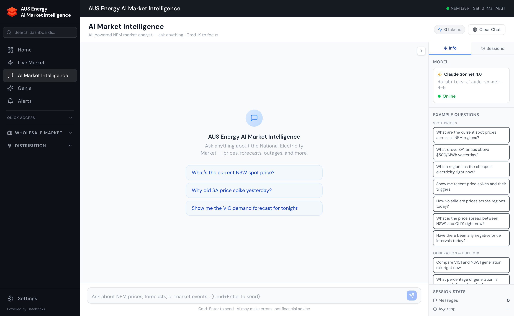

import { Aside } from '@astrojs/starlight/components';



## Overview

The AI Market Intelligence Copilot is a conversational AI system powered by Claude Sonnet 4.5, accessed via the Databricks Foundation Model API (FMAPI). It has access to 51 domain-specific tools spanning market data, forecasting, trading, risk, settlement, DNSP operations, and ML inference.

The copilot is the primary interface for analysts and operators who want answers to complex questions that require synthesising data from multiple sources.

## Architecture

```
User Message (React frontend)
        │
        ▼ HTTP POST /api/chat
FastAPI ChatRouter
        │
        ▼ SSE stream
Agentic Loop (up to 5 rounds)
        │
        ├─── Claude Sonnet 4.5 (Databricks FMAPI)
        │           │
        │    Tool Call Decision
        │           │
        ├──────────────────────────────────┐
        │           │                      │
        │    tool_call event (SSE)         │
        │           │                      │
        ▼           ▼                      ▼
   get_latest_prices  get_stpis_metrics  explain_price_event
        │           │                      │
        ▼           ▼                      ▼
   Gold Table    Gold Table          Gold Table + LLM
   (Lakebase)    (SQL Warehouse)      analysis
        │
        ▼ tool_result event (SSE)
Claude synthesises results
        │
        ▼ text event (SSE)
Streaming response to user
        │
        ▼ done event (SSE)
```

## Tool Categories

### Market Data Tools (8 tools)

| Tool | Description |
|------|-------------|
| `get_latest_prices` | Current spot prices for all or specified regions |
| `get_price_history` | Historical prices with region/date/interval filters |
| `get_generation_mix` | Current or historical generation by fuel type |
| `get_interconnector_flows` | Current interconnector flows and utilisation |
| `get_active_constraints` | Currently active AEMO constraint sets |
| `get_fcas_prices` | Current and historical FCAS prices for all 8 services |
| `get_weather_data` | Temperature, humidity, wind speed for NEM regions |
| `get_market_brief` | Today's or historical daily NEM market brief |

### Forecasting Tools (5 tools)

| Tool | Description |
|------|-------------|
| `get_price_forecast` | ML price forecast (30-min, 4h, 24h horizons) |
| `get_demand_forecast` | ML demand forecast for specified region and horizon |
| `get_weather_forecast` | BOM NWP forecast (next 72 hours) |
| `get_wind_forecast` | Wind generation forecast |
| `get_solar_forecast` | Solar generation forecast (utility + rooftop) |

### Analysis Tools (4 tools)

| Tool | Description |
|------|-------------|
| `explain_price_event` | Identifies likely drivers of a price event (spike, trough, separation) |
| `compare_regions` | Side-by-side comparison of specified regions on a metric |
| `get_market_summary` | High-level market summary for specified period |
| `search_market_rules` | Semantic search over AEMO rules and procedures (Vector Search) |

### Trading Tools (6 tools)

| Tool | Description |
|------|-------------|
| `get_trading_signals` | Current algorithmic trading signals |
| `get_forward_curves` | Forward price curves from ASX futures |
| `get_deal_positions` | Current portfolio positions |
| `get_mtm_valuation` | Current MtM for portfolio or deal |
| `get_bid_stack` | Current merit order and bid stack |
| `get_battery_dispatch` | BESS dispatch status and revenue |

### Risk Tools (5 tools)

| Tool | Description |
|------|-------------|
| `get_var` | Value at Risk (historical simulation or Monte Carlo) |
| `get_greeks` | Options Greeks for positions |
| `get_credit_exposure` | Counterparty credit exposure |
| `get_position_limits` | Position limit utilisation |
| `run_scenario` | Custom price scenario and portfolio impact |

### Portfolio Tools (3 tools)

| Tool | Description |
|------|-------------|
| `get_portfolio_summary` | Portfolio P&L, MtM, and key metrics |
| `get_pnl_attribution` | P&L attribution by driver |
| `get_realised_pnl` | Realised P&L for period |

### Settlement Tools (3 tools)

| Tool | Description |
|------|-------------|
| `get_settlement_summary` | Settlement balance and true-up by run |
| `get_prudential_status` | Current prudential deposit and requirement |
| `get_compliance_calendar` | Upcoming regulatory deadlines |

### Network / DNSP Tools (5 tools)

| Tool | Description |
|------|-------------|
| `get_stpis_metrics` | SAIDI/SAIFI/MAIFI and revenue impact |
| `get_asset_health_scores` | Asset health index and failure predictions |
| `get_vegetation_risk_scores` | ML vegetation risk by span or zone |
| `get_hosting_capacity` | DER hosting capacity by network zone |
| `get_workforce_forecast` | ML workforce demand forecast |

### DNSP AI Tools (11 tools)

| Tool | Description |
|------|-------------|
| `get_aio_compliance_status` | AIO obligation tracking |
| `calculate_rab_rollforward` | RAB projection with configurable assumptions |
| `get_rab_sensitivity` | WACC and inflation sensitivity analysis |
| `get_dnsp_benchmarks` | AER benchmark comparison |
| `get_contractor_scorecard` | Contractor performance metrics |
| `generate_aio_draft` | Claude drafts AIO submission section |
| `get_dapr_inputs` | DAPR data compilation |
| `get_outage_schedule` | Planned network outage calendar |
| `get_hosting_capacity_detail` | Detailed hosting capacity by zone |
| `get_der_pipeline` | DER connection application pipeline |
| `get_skills_gap` | Workforce skills gap analysis |

### Other Tools (1 tool)

| Tool | Description |
|------|-------------|
| `get_generator_info` | Registered generator details from AEMO |

**Total: 51 tools**

## The Agentic Loop

The copilot implements a multi-round agentic loop:

```python
# Simplified agentic loop
async def run_copilot(messages: list, tools: list) -> AsyncGenerator:
    max_rounds = 5
    round_count = 0

    while round_count < max_rounds:
        response = await claude.messages.create(
            model="databricks-claude-sonnet-4-5",
            messages=messages,
            tools=tools,
            stream=True
        )

        async for event in response:
            if event.type == "text":
                yield SSEEvent(type="text", data=event.text)

            elif event.type == "tool_use":
                yield SSEEvent(type="tool_call", data=event.tool_name)
                result = await execute_tool(event.tool_name, event.tool_input)
                yield SSEEvent(type="tool_result", data=result)
                messages.append({"role": "tool", "content": result})

        if response.stop_reason == "end_turn":
            break  # No more tool calls needed

        round_count += 1

    yield SSEEvent(type="done")
```

## Example Conversations

### NEM Market Analysis

```
User: Why did SA1 spot price spike to $12,000/MWh this afternoon?

Copilot: [calls explain_price_event, get_generation_mix, get_active_constraints, get_weather_data]

Claude: The SA1 price spike to $12,000/MWh between 16:30 and 17:00 AEST today
was driven by a convergence of three factors:

1. **Wind output collapse**: SA1 wind generation fell from 1,240 MW to 380 MW
   in the 60 minutes prior to the spike — a 69% reduction triggered by a wind
   change moving through the Adelaide plains.

2. **Binding interconnector**: The V-SA interconnector was at 100% utilisation
   (importing 630 MW from Victoria). The N^^NIL_NVVT_29 constraint was binding,
   preventing additional import to offset the wind loss.

3. **Hot afternoon demand**: Adelaide reached 38°C, pushing SA1 demand to
   2,150 MW — 12% above the seasonal average for this time of year.

With wind down, interconnectors at limit, and demand elevated, only the most
expensive OCGT peakers remained available — Quarantine Power Station bid its
remaining capacity into bands 6 and 7 (>$10,000/MWh), setting the dispatch price.
```

### DNSP Analysis

```
User: Which Ausgrid assets are at highest failure risk this month?

Copilot: [calls get_asset_health_scores with dnsp=ausgrid, min_probability=0.3]

Claude: The ML failure prediction model has flagged 23 Ausgrid assets with
>30% failure probability in the next 12 months. The top 5 by risk are:

1. **TXF-NW-0847** (Zone substation transformer, Blacktown): 68% failure probability.
   Built in 1974, health index 22/100. Last oil test showed elevated furans
   indicating advanced insulation degradation.

2. **TXF-SW-1204** (Distribution transformer, Campbelltown): 61% failure probability...
```

## SSE Event Types

The copilot endpoint (`POST /api/chat`) streams Server-Sent Events:

| Event Type | Payload | Description |
|-----------|---------|-------------|
| `text` | `{"delta": "..."}` | Incremental text from Claude |
| `tool_call` | `{"tool": "...", "input": {...}}` | Tool being called |
| `tool_result` | `{"tool": "...", "result": {...}}` | Tool execution result |
| `done` | `{}` | Stream complete |
| `error` | `{"message": "..."}` | Error occurred |

<Aside type="note">
  The copilot explicitly avoids trading advice and investment recommendations. The system prompt includes guardrails that prevent Claude from making specific buy/sell recommendations.
</Aside>
