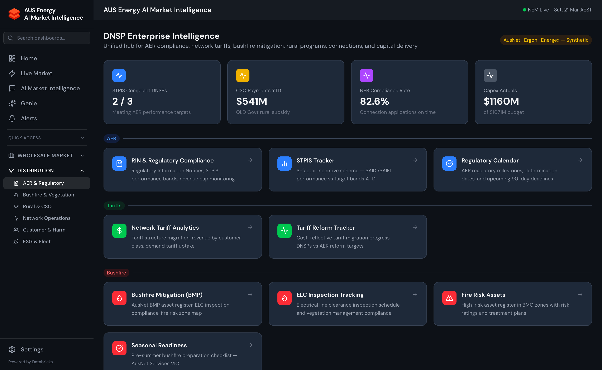

import { Card, CardGrid } from '@astrojs/starlight/components';



## What Is a DNSP?

A **Distribution Network Service Provider (DNSP)** owns and operates the electricity distribution network — the poles, wires, and substations that deliver electricity from the transmission network to homes and businesses. DNSPs are regulated under the National Electricity Rules by the Australian Energy Regulator (AER).

In the NEM, there are six major DNSPs:

| DNSP | State(s) | Coverage Area | Customers |
|------|----------|--------------|-----------|
| **AusNet Services** | VIC | Eastern Victoria | ~720,000 |
| **Ergon Energy** | QLD | Regional QLD | ~730,000 |
| **Energex** | QLD | South East QLD | ~1.4M |
| **Ausgrid** | NSW | Greater Sydney, Central Coast, Hunter | ~1.7M |
| **Essential Energy** | NSW | Rural/Regional NSW | ~870,000 |
| **SA Power Networks** | SA | Entire SA (excl. remote) | ~870,000 |

*(Western Australia and the Northern Territory are outside the NEM.)*

## Why DNSPs Need Intelligence

DNSPs operate under a regulatory compact with strict obligations:

1. **Revenue regulation**: AER sets revenue caps through 5-year regulatory determination periods
2. **Service standards**: AER enforces reliability targets (SAIDI, SAIFI, MAIFI) via STPIS
3. **Annual reporting**: RIN (Regulatory Information Notices) and Annual Information Obligations
4. **Asset management**: expenditure must be justified to the AER and recover efficiently
5. **Safety**: electrical safety obligations under state Safety Regulator (ESV, WorkSafe, etc.)
6. **DER integration**: managing the influx of rooftop solar and batteries on the LV network

Managing these obligations at scale — across tens of thousands of kilometres of network and millions of customer connections — requires sophisticated analytics.

## DNSP Intelligence Sub-groups

<CardGrid>
  <Card title="AER Regulatory" icon="document">
    RIN submissions, annual reporting requirements, revenue determination tracking, and AER correspondence management.
  </Card>
  <Card title="AIO & STPIS Compliance" icon="setting">
    Annual Information Obligations tracking, SAIDI/SAIFI/MAIFI metrics, STPIS incentive calculations, and AI-assisted anomaly detection.
  </Card>
  <Card title="Asset Intelligence" icon="star">
    Asset health scoring, failure prediction (XGBoost, AUC 0.961), expenditure justification, risk matrix, and cross-system integration.
  </Card>
  <Card title="RAB Roll-Forward" icon="rocket">
    Regulatory Asset Base modelling, capex additions, depreciation, inflation indexing, WACC sensitivity, and 5-year waterfall.
  </Card>
  <Card title="Vegetation Risk" icon="list-format">
    ELC compliance, BMO zone assessment, ML span risk scoring (XGBoost, F1 86.3%), inspection scheduling, and bushfire mitigation.
  </Card>
  <Card title="Hosting Capacity & DER" icon="open-book">
    LV hosting capacity analysis, solar PV connection limits, battery storage hosting, curtailment risk mapping, and DER export management.
  </Card>
  <Card title="Workforce Analytics" icon="sun">
    Contractor scorecard, opex benchmarking, field crew productivity, skills gap analysis, and ML demand forecasting (Prophet + XGBoost, MAPE 4.2%).
  </Card>
  <Card title="Benchmarking" icon="information">
    AER efficiency benchmarks, 6-DNSP peer group comparison, opex/capex benchmarks, and regulatory reset preparation analysis.
  </Card>
  <Card title="DAPR Assembly" icon="document">
    Distribution Annual Planning Report builder: demand forecast, network capability statement, REZ contribution, and compliance checklist.
  </Card>
</CardGrid>

## DNSP-Specific Data

Energy Copilot maintains a comprehensive set of DNSP-specific Gold tables:

| Table | Description |
|-------|-------------|
| `gold.dnsp_asset_register` | All network assets with health scores and attributes |
| `gold.dnsp_aio_metrics` | Annual Information Obligation tracking metrics |
| `gold.dnsp_stpis_metrics` | SAIDI, SAIFI, MAIFI by feeder and region |
| `gold.dnsp_rab_schedule` | Regulatory Asset Base schedule with roll-forward |
| `gold.dnsp_vegetation_risk` | Vegetation risk scores by network span |
| `gold.dnsp_workforce_metrics` | Workforce analytics and demand forecasts |
| `gold.dnsp_hosting_capacity` | LV and HV hosting capacity by zone |
| `gold.dnsp_benchmarks` | Peer comparison benchmarks from AER data |
| `gold.dnsp_dapr_data` | DAPR input data and compiled report sections |
| `gold.dnsp_outages` | Planned and unplanned outage register |

## DNSP-Specific AI Tools

The AI Copilot has 11 DNSP-specific tools (in addition to the 40 general energy tools):

| Tool | Description |
|------|-------------|
| `get_aio_compliance_status` | AIO obligations status and due dates |
| `get_stpis_metrics` | SAIDI/SAIFI/MAIFI by feeder/region |
| `get_asset_health_scores` | Asset health and failure risk scores |
| `calculate_rab_rollforward` | RAB projection with configurable parameters |
| `get_vegetation_risk_scores` | Vegetation risk by span or zone |
| `get_hosting_capacity` | Hosting capacity by network zone |
| `get_workforce_forecast` | ML workforce demand forecast |
| `get_benchmarking_metrics` | Peer comparison for opex/capex |
| `generate_aio_draft` | Claude-generated AIO section draft |
| `get_dapr_inputs` | DAPR data compilation |
| `get_rab_sensitivity` | WACC and inflation sensitivity analysis |

## API Base Paths

All DNSP endpoints are served from `/api/dnsp/`:

```
/api/dnsp/aio/          # AIO compliance
/api/dnsp/stpis/        # STPIS metrics
/api/dnsp/assets/       # Asset intelligence
/api/dnsp/rab/          # RAB modelling
/api/dnsp/vegetation/   # Vegetation risk
/api/dnsp/hosting/      # Hosting capacity
/api/dnsp/workforce/    # Workforce analytics
/api/dnsp/benchmarks/   # AER benchmarking
/api/dnsp/dapr/         # DAPR assembly
/api/dnsp/outages/      # Outage management
```
