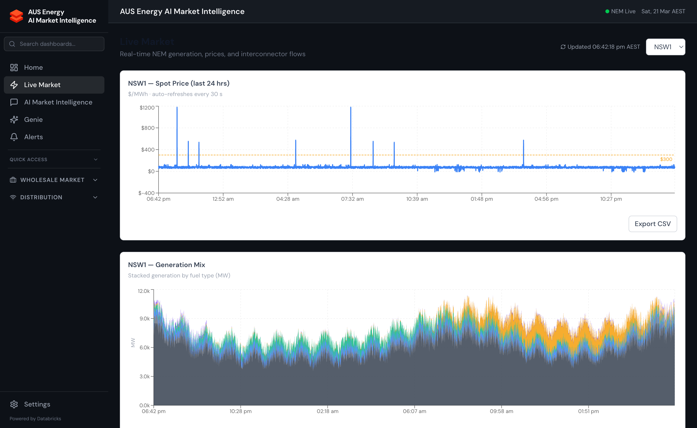

import { Aside } from '@astrojs/starlight/components';



## Overview

The Live Market section is the core real-time dashboard for NEM price monitoring. It provides 5-minute dispatch prices and 30-minute trading interval prices for all five NEM regions, interconnector flows, and active constraint set monitoring — all with sub-10ms latency via Lakebase.

## NEM Price Structure

The NEM uses a two-tier pricing structure:

| Price Type | Interval | Settles Against | Range |
|-----------|----------|----------------|-------|
| **Dispatch Price** | 5-minute | Generation dispatch | -$1,000/MWh to $16,600/MWh |
| **Spot Price** | 30-minute | Retail contracts | Average of six 5-min dispatch prices |

The **Market Price Cap (MPC)** is $16,600/MWh. The **Cumulative Price Threshold (CPT)** triggers when cumulative 30-minute prices exceed $244,000/MWh over a rolling 7-day window, capping subsequent prices at the **Administered Price Cap (APC)** of $300/MWh until the CPT resets.

## Regional Coverage

Energy Copilot tracks all five NEM regions:

| Region | State(s) | Typical Price Range | Key Drivers |
|--------|----------|--------------------|-|
| **NSW1** | New South Wales + ACT | $50–$150/MWh | Brown coal, gas peakers, interconnector flows |
| **QLD1** | Queensland | $50–$200/MWh | Brown coal, rooftop solar, hot weather |
| **SA1** | South Australia | $50–$500/MWh | High renewables, gas peakers, TIPS interconnector |
| **TAS1** | Tasmania | $0–$100/MWh | Hydro-dominated, Basslink-dependent |
| **VIC1** | Victoria | $50–$150/MWh | Brown coal (Latrobe Valley), gas, Snowy |

<Aside type="note">
  South Australia has the highest price volatility in the NEM due to very high renewable penetration (often >100% of demand from wind + rooftop solar) and limited synchronous generation for frequency support.
</Aside>

## Dashboard Pages

### Spot Prices Dashboard (`/front-office/spot-prices`)

- Live 5-minute price chart for all regions with time axis controls (1h, 6h, 24h, 7d)
- Current price table with colour coding: green (&lt;$100), amber ($100–$500), red (>$500), black (>$5,000)
- Price duration curve — percentage of time at each price band
- Negative price frequency — occurrences and duration of negative dispatch prices

### Regional Price Map (`/front-office/price-map`)

- Geographic SVG map of Australia with colour-coded regional prices
- Animated interconnector arrows showing direction and MW flow
- Click a region to drill into detailed regional analytics

### Dispatch Interval Prices (`/front-office/dispatch-prices`)

- Full 5-minute dispatch price table — current trading day
- Filter by region, price band, or constraint flag
- Export to CSV for settlement reconciliation

### Market Depth (`/front-office/market-depth`)

- AEMO pre-dispatch price forecasts (30-minute, 5-minute pre-dispatch)
- Demand vs supply stack chart — where supply meets demand determines the dispatch price
- Generation offer price bands and quantities (aggregated, not DUID-level)

## Interconnectors

The NEM has five major interconnectors that Energy Copilot monitors:

| Interconnector | Route | Direction Convention | Capacity |
|-------------|-------|---------------------|----------|
| **QNI** | QLD ↔ NSW | Positive = QLD→NSW | 1,078 MW |
| **VIC1-NSW1** | VIC ↔ NSW | Positive = VIC→NSW | 1,600 MW |
| **V-SA** | VIC ↔ SA | Positive = VIC→SA | 650 MW |
| **BASSLINK** | VIC ↔ TAS | Positive = VIC→TAS | 594 MW |
| **T-V-MNSP1** | TAS ↔ VIC | Variable | 500 MW |

*Screenshot: Interconnector flow diagram showing real-time MW flows between regions with utilisation percentage indicators.*

## API Examples

### Fetch Latest Prices

```bash
GET /api/prices/latest

# Response
{
  "timestamp": "2025-03-21T05:30:00Z",
  "interval_type": "dispatch",
  "regions": {
    "NSW1": {"price": 87.32, "demand_mw": 8420},
    "QLD1": {"price": 124.56, "demand_mw": 7210},
    "SA1":  {"price": 215.40, "demand_mw": 1580},
    "TAS1": {"price": 45.20, "demand_mw": 1240},
    "VIC1": {"price": 98.70, "demand_mw": 6890}
  }
}
```

### Fetch Price History

```bash
GET /api/prices/history?region=SA1&start=2025-03-14&end=2025-03-21&interval=30min

# Optional parameters:
# region: NSW1|QLD1|SA1|TAS1|VIC1 (default: all)
# start: ISO 8601 date (default: 24h ago)
# end: ISO 8601 date (default: now)
# interval: 5min|30min (default: 30min)
```

### Response Headers

Every price response includes:

```http
X-Data-Source: lakebase
X-Query-Ms: 12.3
X-Cache-Hit: true
X-Cache-Age-Seconds: 8
```

## Gold Table Schema

```sql
-- gold.nem_prices_5min
SELECT
    interval_datetime,      -- TIMESTAMP: 5-min dispatch interval end time (UTC)
    interval_date,          -- DATE: partition column
    region_id,              -- STRING: NSW1, QLD1, SA1, TAS1, VIC1
    rrp,                    -- DOUBLE: regional reference price ($/MWh)
    demand,                 -- DOUBLE: scheduled demand (MW)
    net_interchange,        -- DOUBLE: net import (+) or export (-) via interconnectors (MW)
    is_price_capped,        -- BOOLEAN: true when CPT active
    ingest_timestamp        -- TIMESTAMP: when this row was loaded
FROM energy_copilot.gold.nem_prices_5min
WHERE interval_date = CURRENT_DATE()
ORDER BY interval_datetime DESC
LIMIT 100;
```

## Price Alert Thresholds

The platform generates alerts at these price thresholds:

| Alert Level | Threshold | Colour | Notification |
|-------------|----------|--------|-------------|
| Moderate spike | > $300/MWh | Amber | Dashboard banner |
| High spike | > $1,000/MWh | Red | In-app alert + email |
| Critical spike | > $5,000/MWh | Black | All channels |
| Sustained high | > $300 for 30+ minutes | Red | In-app alert |
| Negative prices | < -$50/MWh | Purple | Dashboard banner |

<Aside type="tip">
  Price alerts can be configured per region and per threshold in **Settings → Alert Configuration**. Alerts are stored in Lakebase (`user_preferences` and `alert_configs` tables) and persist across sessions.
</Aside>
