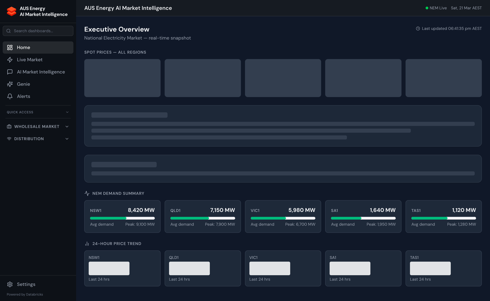

import { Card, CardGrid, LinkCard } from '@astrojs/starlight/components';

## Platform at a Glance

<CardGrid>
  <Card title="547 Pages" icon="document">
    React 18 + TypeScript frontend with dashboards spanning all NEM market segments: spot prices, generation, FCAS, gas, renewables, battery storage, and DNSP intelligence.
  </Card>
  <Card title="62 Routers / 979+ Endpoints" icon="setting">
    FastAPI backend with modular routers for every domain: market data, DNSP, settlement, risk, ML inference, and AI copilot streaming.
  </Card>
  <Card title="58 AI Tools" icon="star">
    Claude Sonnet 4.5 via Databricks Foundation Model API with 58 tools covering market data retrieval, ML forecasting, trading analysis, risk management, and DNSP operations.
  </Card>
  <Card title="16 Genie Spaces" icon="open-book">
    AI/BI Genie spaces for natural language SQL across NEM prices, generation, interconnectors, FCAS, settlement, DNSP compliance, and more.
  </Card>
  <Card title="39 Pipeline Jobs" icon="rocket">
    Serverless Databricks jobs orchestrating Bronze→Silver→Gold data ingestion from AEMO NEMWEB, BOM weather, AER CDR, OpenElectricity, STTM gas, and 15 other sources.
  </Card>
  <Card title="113+ Gold Tables" icon="list-format">
    Unity Catalog medallion lakehouse with 113+ curated Gold Delta tables feeding real-time dashboards and ML models with sub-10ms query latency via Lakebase.
  </Card>
</CardGrid>

## Core Capabilities

<CardGrid>
  <LinkCard
    title="AI Market Intelligence Copilot"
    description="Conversational AI with 51 domain-specific tools. Ask about spot prices, explain price events, run what-if scenarios, generate DNSP compliance reports — all in natural language."
    href="/databricks-energy-ai-intelligence/ai-ml/copilot"
  />
  <LinkCard
    title="Real-Time NEM Data"
    description="5-minute dispatch prices, generation by fuel type, interconnector flows, and FCAS prices — all sourced directly from AEMO NEMWEB with sub-10ms serving via Databricks Lakebase."
    href="/databricks-energy-ai-intelligence/front-office/live-market"
  />
  <LinkCard
    title="DNSP Intelligence Suite"
    description="End-to-end intelligence for Distribution Network Service Providers: AER regulatory compliance, asset health scoring, RAB roll-forward, vegetation risk ML, and DAPR assembly."
    href="/databricks-energy-ai-intelligence/dnsp/overview"
  />
  <LinkCard
    title="ML Forecasting"
    description="XGBoost and Prophet models for NEM price forecasting, asset failure prediction, vegetation risk classification, workforce demand forecasting, and STPIS anomaly detection."
    href="/databricks-energy-ai-intelligence/ai-ml/overview"
  />
</CardGrid>

## Live Application

The Energy Copilot platform is deployed and accessible at:

**[https://energy-copilot-7474645691011751.aws.databricksapps.com](https://energy-copilot-7474645691011751.aws.databricksapps.com)**

The application runs as a Databricks App, combining a React frontend served as static files with a FastAPI backend that queries Unity Catalog Gold tables via Lakebase (primary) or SQL Warehouse (fallback).

## Who Is This For?

| Role | Primary Use Cases |
|------|------------------|
| **NEM Traders** | Live spot prices, forward curves, trading signals, VaR, P&L attribution |
| **Portfolio Analysts** | MtM valuation, position management, risk limits, Greeks |
| **DNSP Operators** | AER compliance, asset health, RAB modelling, DAPR assembly |
| **Market Analysts** | Daily NEM briefs, generation mix, interconnector constraints, FCAS |
| **Data Scientists** | MLflow experiment tracking, model performance, feature store |
| **Compliance Officers** | NER obligations calendar, AER enforcement register, LGC registry |
