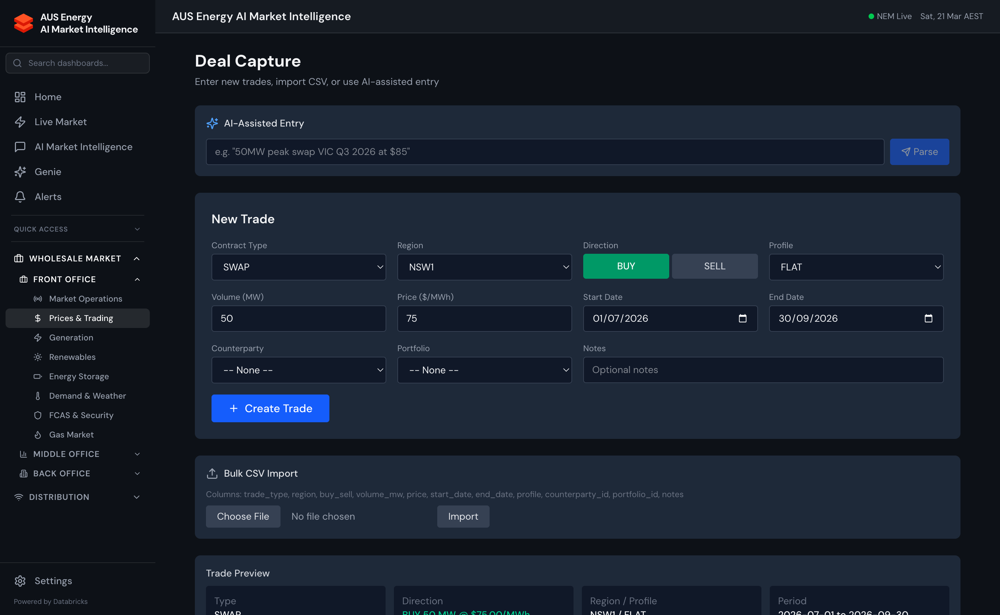

import { Aside } from '@astrojs/starlight/components';



## Overview

The Deal Capture module is the front-end of Energy Copilot's ETRM system. It allows traders to enter, amend, and cancel energy derivative deals, which are then reflected immediately in portfolio positions and MtM valuations.

## Supported Deal Types

| Deal Type | Description | Common Use Case |
|-----------|-------------|----------------|
| **Fixed-for-Float Swap** | Exchange fixed price for NEM spot price (or vice versa) | Base load hedge |
| **Cap** | Call option on NEM spot price — payoff when spot > strike | Generator protection against high prices |
| **Floor** | Put option on NEM spot price — payoff when spot < strike | Retailer protection against low prices |
| **Collar** | Combination of cap and floor — limits both upside and downside | Two-way hedge structure |
| **PPA (Power Purchase Agreement)** | Long-term contract for renewable energy at fixed price | Corporate renewable procurement |
| **Spot Purchase/Sale** | Physical spot energy at NEM settlement price | Balancing residual position |
| **Basis Swap** | Exchange prices between two NEM regions | Interconnector spread trading |
| **FCAS Contract** | Contracted FCAS availability or price agreement | BESS revenue certainty |

## Deal Entry

### Deal Form Fields

Navigating to **Middle Office → Deal Capture → New Deal** opens the deal entry form:

| Field | Type | Description |
|-------|------|-------------|
| `deal_type` | Enum | Swap, Cap, Floor, Collar, PPA, Spot, Basis, FCAS |
| `portfolio_id` | FK | Which portfolio this deal belongs to |
| `counterparty_id` | FK | Registered counterparty |
| `region_id` | Enum | NSW1, QLD1, SA1, TAS1, VIC1 |
| `direction` | Enum | Buy / Sell |
| `volume_mw` | Float | Notional volume in MW |
| `start_date` | Date | Contract start |
| `end_date` | Date | Contract end |
| `strike_price` | Float | Fixed price in $/MWh (swaps and options) |
| `premium_aud` | Float | Option premium paid/received (caps, floors, collars) |
| `trade_date` | Date | Date deal was agreed |
| `trader_id` | String | Trader username |
| `broker` | String | Broker (if brokered) |
| `notes` | Text | Free text |

### Validation

On submission, the deal form validates:
- Counterparty credit limit not exceeded (raises warning if within 10% of limit)
- Start date before end date
- Volume is positive
- Strike price is within reasonable market bounds ($0–$20,000/MWh)
- Portfolio exists and trader has write permission

## Position Tracking

After deal entry, positions are aggregated in `gold.positions`:

```sql
-- Current open positions by region and portfolio
SELECT
    portfolio_name,
    region_id,
    deal_type,
    SUM(volume_mw * direction_sign) AS net_position_mw,
    SUM(volume_mw * direction_sign * strike_price) AS notional_aud,
    COUNT(*) AS deal_count
FROM energy_copilot.gold.positions
WHERE status = 'active'
GROUP BY portfolio_name, region_id, deal_type
ORDER BY portfolio_name, region_id;
```

## Counterparty Management

The counterparty registry (`gold.counterparties`) stores:
- Company name and ABN
- Credit limit (AUD)
- Current exposure (updated daily from MtM)
- ISDA EFET master agreement details
- Payment terms (settlement lag in days)

Pre-seeded counterparties:

| Counterparty | Credit Limit | Type |
|-------------|-------------|------|
| AGL Energy | $50M | Integrated |
| Origin Energy | $50M | Integrated |
| EnergyAustralia | $40M | Retailer |
| Shell Energy | $30M | Trading house |
| Macquarie Energy | $30M | Financier |

## Portfolio Hierarchy

```
Master Portfolio
├── Wholesale Portfolio
│   ├── NSW Hedges
│   ├── QLD Hedges
│   └── SA Hedges
├── Retail Hedge Portfolio
│   ├── Residential Load Hedges
│   └── C&I Load Hedges
└── FCAS Portfolio
    ├── Regulation Services
    └── Contingency Services
```

## API Endpoints

```bash
# List all deals
GET /api/deals?portfolio_id=1&status=active

# Create new deal
POST /api/deals
Content-Type: application/json
{
  "deal_type": "swap",
  "portfolio_id": 1,
  "counterparty_id": 2,
  "region_id": "SA1",
  "direction": "buy",
  "volume_mw": 100,
  "start_date": "2025-04-01",
  "end_date": "2025-12-31",
  "strike_price": 120.00,
  "trade_date": "2025-03-21"
}

# Amend deal
PATCH /api/deals/{deal_id}

# Cancel deal
DELETE /api/deals/{deal_id}

# Position summary
GET /api/deals/positions?portfolio_id=1
```

<Aside type="note">
  Deal data is stored in `gold.deals` with Lakebase-backed serving for sub-10ms reads. Writes go directly to the Delta table via the SQL Warehouse and are then synced to Lakebase. There is a ~30-second lag between deal entry and Lakebase availability — the UI shows a "syncing" indicator during this window.
</Aside>

<Aside type="caution">
  This is a demonstration ETRM system. It does not connect to external clearing systems (ASX Clear, EnergyAustralia OTC) and should not be used for actual trading operations without appropriate integrations and legal review.
</Aside>
