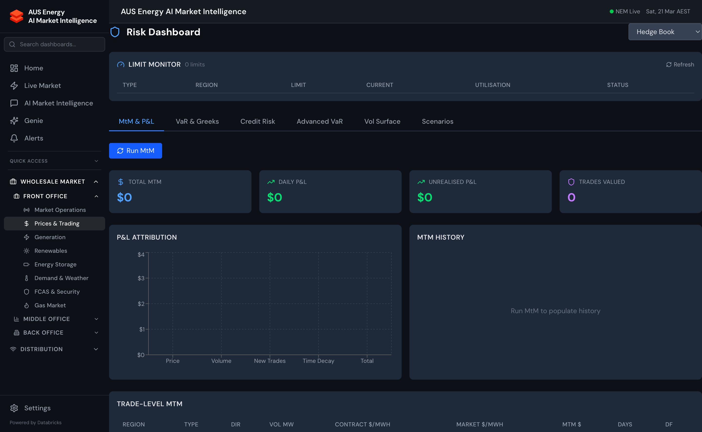

import { Aside } from '@astrojs/starlight/components';



## Overview

Energy Copilot's Risk Management module provides quantitative risk analytics for energy derivative portfolios. It combines standard financial risk methodologies (VaR, Greeks) with energy-specific risk factors (price spikes, weather volatility, renewable generation uncertainty).

## Value at Risk (VaR)

Energy Copilot implements two VaR methodologies:

### Historical Simulation VaR

Historical Simulation VaR uses the actual distribution of historical price returns, without assuming a normal distribution. This captures the heavy tails and skewness characteristic of electricity prices:

```
VaR(1-day, 95%) = -P5th_percentile(Σ daily_pnl_changes over lookback_window × current_position)
```

Parameters:
- **Lookback window**: 250 trading days (1 calendar year)
- **Confidence level**: 95% (standard) or 99% (regulatory reporting)
- **Holding period**: 1 day (operational) or 10 days (regulatory)

### Monte Carlo VaR

Monte Carlo VaR simulates 10,000 price paths using a mean-reverting jump-diffusion model calibrated to NEM spot prices:

```python
def simulate_nem_price(
    S0: float,         # Current spot price
    kappa: float,      # Mean reversion speed
    theta: float,      # Long-run mean
    sigma: float,      # Volatility
    lambda_j: float,   # Jump intensity (spikes/year)
    mu_j: float,       # Mean jump size
    sigma_j: float,    # Jump size std dev
    T: float,          # Time horizon (days)
    n_sims: int = 10000
) -> np.ndarray:
    """
    Merton jump-diffusion with mean reversion.
    Parameters calibrated separately per region from historical data.
    """
    ...
```

<Aside type="note">
  The NEM spot price exhibits strong mean-reversion combined with infrequent large jumps (price spikes). Standard geometric Brownian motion significantly underestimates tail risk. The jump-diffusion model is calibrated quarterly.
</Aside>

## Risk Dashboard

### VaR Summary (`/middle-office/risk/var`)

- VaR at 95% and 99% confidence for each portfolio and the total book
- Comparison: Historical Simulation vs Monte Carlo VaR
- Back-testing: how many days in the past year did actual losses exceed VaR?
- Stressed VaR: VaR recalculated on the 2009 January heatwave scenario

### Risk Factor Attribution

The risk is decomposed by driver:

| Risk Factor | Description | Method |
|------------|-------------|--------|
| **Region Price Risk** | Exposure to spot price movements per region | Delta × price volatility |
| **Tenor Risk** | Exposure to curve shape changes | DV01 per tenor bucket |
| **Volatility Risk** | Options book exposure to implied vol changes | Vega × vol change |
| **Correlation Risk** | Regional price correlation breakdown | Off-diagonal covariance |
| **Jump Risk** | Spike event impact on unhedged positions | Monte Carlo jump paths |

## Greeks for Options and PPAs

### Cap and Floor Greeks

For options positions (caps, floors, collars), Energy Copilot calculates Black-76 Greeks:

| Greek | Symbol | Interpretation |
|-------|--------|---------------|
| **Delta** | Δ | Change in option value per $1 change in forward price |
| **Gamma** | Γ | Rate of change of delta per $1 change in forward price |
| **Vega** | ν | Change in option value per 1% change in implied volatility |
| **Theta** | θ | Daily time decay (option value lost per day) |
| **Rho** | ρ | Sensitivity to risk-free rate (small in energy markets) |

### PPA Greeks

Power Purchase Agreements (PPAs) have price and volume risk:

- **Price Delta**: sensitivity to change in wholesale forward prices
- **Volume Uncertainty**: P90/P50/P10 generation scenarios affect actual settlement
- **Cannibalisation Risk**: correlated generation across renewable fleet reduces captured prices

## Credit Risk

Credit risk measures the exposure to counterparty default:

```
Credit_Exposure = max(0, MtM_value)
Credit_Limit_Utilisation = Credit_Exposure / Credit_Limit × 100
```

The platform generates alerts when any counterparty's credit utilisation exceeds 80% of their approved limit.

Credit risk metrics:
- **Current Exposure**: sum of positive MtM values per counterparty
- **Potential Future Exposure (PFE)**: maximum exposure at 97.5% confidence over deal life
- **CVA** (Credit Value Adjustment): discount for counterparty default probability

## Position Limits Monitoring

Real-time limit monitoring against defined thresholds:

```sql
-- Query current limit utilisation
SELECT
    portfolio_name,
    limit_type,
    current_value,
    limit_value,
    ROUND(current_value / limit_value * 100, 1) AS utilisation_pct,
    CASE
        WHEN current_value / limit_value > 1.0 THEN 'BREACH'
        WHEN current_value / limit_value > 0.9 THEN 'WARNING'
        WHEN current_value / limit_value > 0.8 THEN 'CAUTION'
        ELSE 'OK'
    END AS status
FROM energy_copilot.gold.limit_monitoring
ORDER BY utilisation_pct DESC;
```

## API Endpoints

```bash
# VaR summary
GET /api/risk/var?portfolio_id=1&confidence=0.95&method=historical

# Monte Carlo simulation results
GET /api/risk/montecarlo?portfolio_id=1&n_sims=10000

# Greeks for options book
GET /api/risk/greeks?portfolio_id=1

# Credit exposure by counterparty
GET /api/risk/credit-exposure

# Limit monitoring status
GET /api/risk/limits?portfolio_id=1
```
